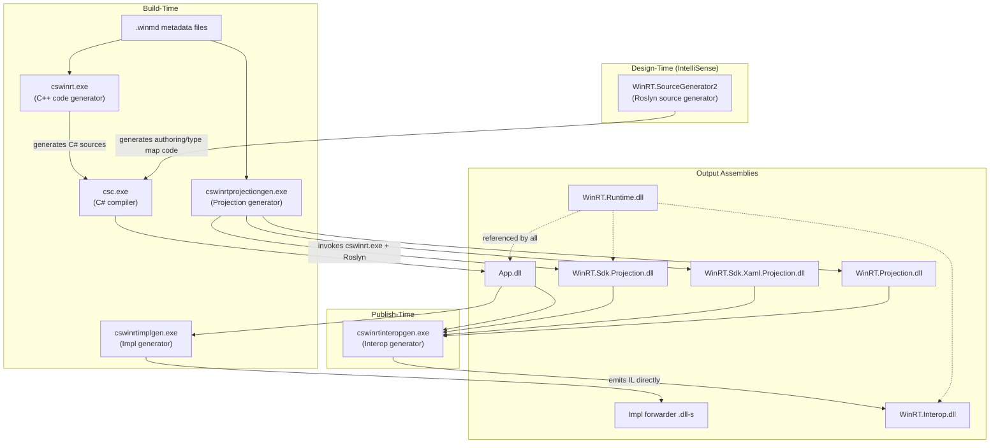
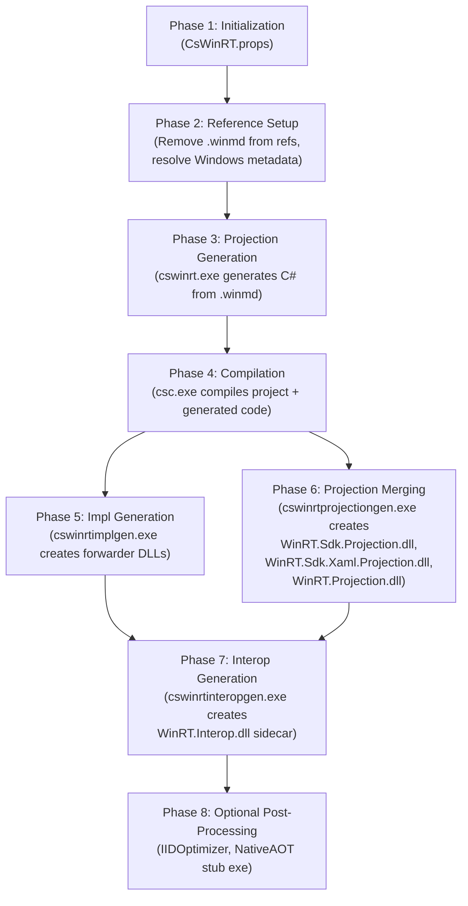

# CsWinRT 3.0 — Copilot instructions

## Project overview

**CsWinRT** (C#/WinRT) provides the Windows Runtime (WinRT) interop stack for C# applications. It replaces the built-in Windows Runtime interop that .NET dropped starting from .NET 5. CsWinRT 3.0 is a ground-up redesign targeting **.NET 10** with trimming and Native AOT as core architecture principles, built on the latest C# 14 language features and new .NET interop APIs.

### Core design principles

- **AOT-first**: all features must work and be fast on Native AOT. All vtables and CCW entries should be foldable by ILC into readonly data sections.
- **Trim-safe and trim-friendly**: all generated code is fully trimmable without user action.
- **Security**: all vtables and COM interface entries are in readonly data sections; all native object lifetime/concurrency issues from 2.x are addressed.
- **Performance**: minimal overhead marshalling, zero-allocation vtables, pre-initialized type hierarchies.
- **Modern C#**: targets .NET 10 / C# 14, uses `Span<T>` projections, `extension` types, `allows ref struct`, `static abstract` interface members, `file`-scoped types, etc.
- **No source generators at publish time**: heavy code generation is done by post-build CLI tools (not source generators), so IntelliSense is never impacted.

### Multi-targeting

CsWinRT 3.0 is fundamentally incompatible with CsWinRT 2.x. The .NET SDK uses the TFM revision number to select the version:

- `net10.0-windows10.0.22621.0` → CsWinRT 2.x
- `net10.0-windows10.0.22621.1` → CsWinRT 3.0

The `CSWINRT3_0` define constant is set when CsWinRT 3.0 is active.

> **Note:** The repository is in active migration from CsWinRT 2.x to 3.0. Not all code in the repo is actively used; focus on the projects described below.

---

## Repository structure (CsWinRT 3.0 projects)

```
CsWinRT/
├── src/
│   ├── WinRT.Runtime2/                    # (1) Runtime library (WinRT.Runtime.dll)
│   ├── Authoring/
│   │   └── WinRT.SourceGenerator2/        # (2) Roslyn source generator + analyzers
│   ├── cswinrt/                           # (3) C++ code generator (cswinrt.exe)
│   ├── WinRT.Impl.Generator/              # (4) Impl/forwarder DLL generator (cswinrtimplgen.exe)
│   ├── WinRT.Projection.Generator/        # (5) Projection DLL generator (cswinrtprojectiongen.exe)
│   ├── WinRT.Interop.Generator/           # (6) Interop sidecar generator (cswinrtinteropgen.exe)
│   └── WinRT.Generator.Tasks/             # (7) MSBuild tasks for the build tools
├── nuget/                                 # MSBuild .props/.targets for NuGet package
├── docs/                                  # Specifications and documentation
└── eng/                                   # Engineering/CI infrastructure
```

---

## Architecture diagram



---

## Build pipeline flow

The CsWinRT 3.0 build pipeline runs through several phases orchestrated by MSBuild targets in the `nuget/` folder:



### Key MSBuild properties

| Property | Default | Description |
|----------|---------|-------------|
| `CsWinRTEnabled` | `true` | Master switch for CsWinRT processing |
| `CsWinRTGenerateProjection` | `true` | Run cswinrt.exe to generate C# projection code |
| `CsWinRTGenerateInteropAssembly2` | auto (`true` for exe) | Generate interop assemblies at publish time |
| `CsWinRTGenerateReferenceProjection` | `false` | Generate reference-only projections (for NuGet packages) |
| `CsWinRTComponent` | `false` | Enable Windows Runtime component authoring mode |
| `CsWinRTUseWindowsUIXamlProjections` | `false` | Use UWP XAML (`Windows.UI.Xaml`) instead of WinUI (`Microsoft.UI.Xaml`) |
| `CsWinRTMergeReferencedActivationFactories` | `false` | Merge activation factories from referenced components |

---

## Project details

### 1. WinRT.Runtime (`src/WinRT.Runtime2/`)

The runtime library (`WinRT.Runtime.dll`) provides all common infrastructure for Windows Runtime interop. It is referenced by all other CsWinRT components and by consuming applications.

**Project settings:**

- **Target**: `net10.0`, C# 14, `AllowUnsafeBlocks`, `DisableRuntimeMarshalling`
- **Root namespace**: `WindowsRuntime`
- **Assembly name**: `WinRT.Runtime` (fixed name; other components depend on it, e.g. the UWP XAML compiler)
- **Warnings as errors**: release only. `EnforceCodeStyleInBuild` enabled, `AnalysisLevelStyle` = `latest-all`.
- **Strong-name signed** with `key.snk`
- **AOT compatible**: `IsAotCompatible = true`

**Directory structure:**

```
WinRT.Runtime2/
├── WindowsRuntimeObject.cs          # Base class for ALL projected runtime classes
├── WindowsRuntimeInspectable.cs     # Fallback type for unknown native objects
├── ABI/                             # ABI type mappings (managed ↔ native)
│   ├── System/                      # Primitives, String, Uri, DateTimeOffset, collections, etc.
│   ├── Windows.Foundation/          # Foundation types (Point, Rect, Size, etc.)
│   └── WindowsRuntime.InteropServices/  # Bindable adapters
├── Attributes/                      # Public marker attributes (e.g. [WindowsRuntimeClassName])
├── InteropServices/                 # Core interop infrastructure (~456 files)
│   ├── Activation/                  # Object activation factories and helpers
│   ├── AsyncInfo/                   # Async operation marshalling
│   ├── Callbacks/                   # ComWrappers callbacks
│   ├── Collections/                 # Collection adapters (IList↔IVector, IDictionary↔IMap, etc.)
│   ├── Events/                      # Event source infrastructure (EventSource<T>, tokens)
│   ├── Exceptions/                  # Exception ↔ HRESULT marshalling
│   ├── InteropDllImports/           # P/Invoke declarations
│   ├── Marshalers/                  # Type marshallers (string, delegate, value type, etc.)
│   ├── Marshalling/                 # High-level marshalling APIs (WindowsRuntimeObjectMarshaller, etc.)
│   ├── ObjectReference/             # Native object lifetime (WindowsRuntimeObjectReference hierarchy)
│   ├── Platform/                    # Platform types (HRESULT, HSTRING, etc.)
│   ├── ProjectionImpls/             # Built-in interface implementations (IStringable, IPropertyValue, etc.)
│   ├── TypeMapGroups/               # Type mapping group markers for ComWrappers
│   ├── TypeMapInfo/                 # Type metadata caching
│   ├── Vtables/                     # COM vtable struct definitions (37 vtable types)
│   └── WeakReferences/              # Weak reference support
├── NativeObjects/                   # Managed wrappers for native Windows Runtime objects (collections, async, etc.)
├── Windows.Foundation/              # Manually projected foundation types
├── Windows.Foundation.Collections/  # Collection interfaces (IObservableVector, IObservableMap, etc.)
├── Properties/                      # Exception messages and extension types
└── Exceptions/                      # Exception types
```

**Key types:**

| Type | Purpose |
|------|---------|
| `WindowsRuntimeObject` | Abstract base class for all projected runtime classes. Implements `IDynamicInterfaceCastable`, `IUnmanagedVirtualMethodTableProvider`, `ICustomQueryInterface`. Manages native COM pointer lifetime, lazy IInspectable caching, and interface resolution. |
| `WindowsRuntimeObjectReference` | Abstract base for native COM object lifetime management. Hierarchy includes `FreeThreadedObjectReference` (agile) and `ContextAwareObjectReference` (thread-affine). Manages `AddRef`/`Release`, GC memory pressure, reference tracker support. |
| `WindowsRuntimeComWrappers` | Singleton `ComWrappers` subclass. Uses thread-local storage for fast-path marshalling. |
| `WindowsRuntimeComWrappersMarshal` | High-level API: `TryUnwrapObjectReference()`, `IsReferenceToManagedObject()`, etc. |
| `WindowsRuntimeObjectMarshaller` | Marshals `object` ↔ `IInspectable*`. Core `ConvertToUnmanaged`/`ConvertToManaged` methods. |
| `EventSource<T>` | Base event source adapter for Windows Runtime events. Specialized subclasses for `EventHandler`, `EventHandler<T>`, `TypedEventHandler<TSender, TResult>`. |
| Collection adapters (`IListAdapter<T>`, etc.) | Bridge .NET collections (`IList<T>`, `IDictionary<K,V>`, etc.) to Windows Runtime collections (`IVector<T>`, `IMap<K,V>`, etc.) |

**Key patterns:**

- **Unsafe code**: extensive use of `void*` for COM pointers, `delegate* unmanaged[MemberFunction]<...>` for vtable function pointers, `stackalloc`, `fixed` statements.
- **C# 14 features**: `extension(Type)` syntax for explicit extensions, `allows ref struct` constraints, `static abstract` interface members, `file`-scoped types, primary constructors.
- **Vtable structs**: all vtables are `[StructLayout(LayoutKind.Sequential)]` structs with unmanaged function pointer fields, matching COM vtable memory layout exactly.
- **Reference counting**: mimics COM `AddRef`/`Release` with managed lease counts and GC memory pressure tracking.
- **T4 templates**: 6 `.tt` files generate constants (`HRESULT` codes, interface IIDs, XAML class names) and specialized marshallers (blittable array types).

### 2. WinRT.SourceGenerator2 (`src/Authoring/WinRT.SourceGenerator2/`)

A Roslyn incremental source generator and diagnostic analyzer package. Runs at **design time** (IntelliSense) and **build time**. It is intentionally lightweight — heavy codegen is deferred to the post-build CLI tools.

**Project settings:**

- **Target**: `net10.0`, C# 14, `IsRoslynComponent = true`
- **Root namespace**: `WindowsRuntime.SourceGenerator`
- **Assembly name**: `WinRT.SourceGenerator2`
- **Dependency**: `Microsoft.CodeAnalysis.CSharp` 5.0.0

**Three source generators:**

| Generator | What It Generates |
|-----------|-------------------|
| `AuthoringExportTypesGenerator` | Activation factory infrastructure for Windows Runtime component authoring. Emits `ManagedExports.g.cs` (with `GetActivationFactory()` method) and `NativeExports.g.cs` (with `DllGetActivationFactory()` entry point for Native AOT). Triggered when `CsWinRTComponent = true`. |
| `CustomPropertyProviderGenerator` | `ICustomPropertyProvider` implementations for XAML data binding. Annotate types with `[GeneratedCustomPropertyProvider]` to auto-generate property accessors. Supports both UWP and WinUI XAML. |
| `TypeMapAssemblyTargetGenerator` | `[TypeMapAssemblyTarget]` assembly attributes for runtime type mapping in AOT scenarios. Discovers referenced Windows Runtime assemblies and registers them with the three type map groups: `WindowsRuntimeComWrappersTypeMapGroup`, `WindowsRuntimeMetadataTypeMapGroup`, `DynamicInterfaceCastableImplementationTypeMapGroup`. |

**Eight diagnostic analyzers** (all errors, IDs `CSWINRT2000`–`CSWINRT2008`):

Validate `[GeneratedCustomPropertyProvider]` usage:

- `CSWINRT2000`: Invalid target type (must be non-abstract, non-static class/struct)
- `CSWINRT2001`: Missing `partial` modifier on target type or containing type
- `CSWINRT2002`: `ICustomPropertyProvider` interface not available (need WinUI or UWP reference)
- `CSWINRT2003`: Type already implements `ICustomPropertyProvider` members
- `CSWINRT2004`–`CSWINRT2008`: Invalid attribute arguments (null names, missing properties/indexers, static indexers)

### 3. cswinrt.exe (`src/cswinrt/`)

A **C++ command-line tool** that reads `.winmd` metadata files and generates C# projection source code for Windows Runtime types.

**Key files:**

| File | Purpose |
|------|---------|
| `main.cpp` | Entry point: parses args, loads metadata, orchestrates parallel namespace generation |
| `settings.h` | Command-line option definitions (`--input`, `--output`, `--include`, `--exclude`, `--reference_projection`, etc.) |
| `code_writers.h` | Primary code generation logic (~456 KB). Contains `write_class()`, `write_interface()`, `write_struct()`, `write_enum()`, `write_delegate()` and their ABI counterparts |
| `type_writers.h` | Type name writing utilities, generic argument tracking |
| `helpers.h` | Type categorization utilities (`is_static()`, `is_type_blittable()`, `get_default_interface()`, etc.) |
| `strings/` | Embedded C# code injected into output (additions for specific namespaces) |

**Input/Output:**

```
cswinrt.exe --input <.winmd files/dirs> --output <dir> [--include/--exclude prefixes]
            [--reference_projection] [--component] [--internal] [--embedded]
```

**Generates two layers of C# code per Windows Runtime type:**

1. **Projected types** (public API): the user-facing C# classes, interfaces, structs, enums, and delegates that developers use directly. Runtime classes inherit `WindowsRuntimeObject`.
2. **ABI layer** (`namespace ABI.{Namespace}`): internal marshalling infrastructure — vtable definitions (structs with unmanaged function pointers), interface method implementations, marshaller classes.

**Namespace additions** (`strings/additions/`): Extra C# code injected into specific namespaces (e.g. `Color.FromArgb()` for `Windows.UI`, XAML struct helpers for `Thickness`, `CornerRadius`, `GridLength`, etc.).

### 4. Impl Generator (`src/WinRT.Impl.Generator/`)

A **.NET CLI tool** (`cswinrtimplgen.exe`) published as a **Native AOT** binary. Generates **forwarder/impl assemblies** that contain only type forwards (no actual code).

**Project settings:**

- **Target**: `net10.0`, `PublishAot = true`, `DisableRuntimeMarshalling`
- **Assembly name**: `cswinrtimplgen`
- **Dependencies**: `AsmResolver.DotNet` (IL manipulation), `ConsoleAppFramework` (CLI)

**Purpose:** Projection `.dll` files in NuGet packages don't need to be updated for new CsWinRT versions. They contain no actual code — just type forwards to the merged projection `.dll` that is generated at app publish time.

**Type forward routing:**

| Input Assembly | Forwards To |
|----------------|-------------|
| `Microsoft.Windows.SDK.NET` | `WinRT.Sdk.Projection` |
| `Microsoft.Windows.UI.Xaml` | `WinRT.Sdk.Xaml.Projection` |
| Any other | `WinRT.Projection` |

**How it works:**

1. Loads the built output assembly using AsmResolver
2. Creates a new empty assembly (the "impl" assembly)
3. Copies well-known assembly attributes (version, debug info, etc.)
4. Emits `[TypeForwarder]` entries for all public top-level types, routing to the appropriate projection assembly
5. Optionally signs with a strong-name key

### 5. Projection Generator (`src/WinRT.Projection.Generator/`)

A **.NET CLI tool** (`cswinrtprojectiongen.exe`) published as a **Native AOT** binary. Takes `.winmd` files as input, invokes `cswinrt.exe` to generate C# sources, then compiles them into a projection `.dll` using the Roslyn APIs.

**Project settings:**

- **Target**: `net10.0`, `PublishAot = true`, `DisableRuntimeMarshalling`
- **Assembly name**: `cswinrtprojectiongen`
- **Dependencies**: `AsmResolver.DotNet`, `ConsoleAppFramework`, `Microsoft.CodeAnalysis.CSharp` (Roslyn)

**Three projection modes:**

| Mode | Output Assembly | Content |
|------|----------------|---------|
| Windows SDK | `WinRT.Sdk.Projection.dll` | Core Windows Runtime types (`Windows.*`, except XAML). Flags: `--windows-sdk-only true` |
| UWP XAML | `WinRT.Sdk.Xaml.Projection.dll` | `Windows.UI.Xaml.*` types (UWP XAML framework). Flags: `--windows-sdk-only true --windows-ui-xaml-projection true` |
| 3rd Party / Merged | `WinRT.Projection.dll` | All non-Windows-SDK types (WindowsAppSDK, WinUI 3, custom components). Default mode. |

**Three-phase pipeline:**

1. **Process References**: Load reference assemblies via AsmResolver, generate `.rsp` response file with namespace filters
2. **Generate Sources**: Invoke `cswinrt.exe @response.rsp` to produce C# files
3. **Emit Assembly**: Parse generated `.cs` files with Roslyn, compile to `.dll` with `CSharpCompilation`, emit with embedded debug info

### 6. Interop Generator (`src/WinRT.Interop.Generator/`)

A **.NET CLI tool** (`cswinrtinteropgen.exe`) published as a **Native AOT** binary. This is the most complex build tool — it analyzes all application assemblies and produces the `WinRT.Interop.dll` sidecar containing all marshalling code.

**Project settings:**

- **Target**: `net10.0`, C# 14, `PublishAot = true`, `DisableRuntimeMarshalling`
- **Assembly name**: `cswinrtinteropgen`
- **Dependencies**: `AsmResolver.DotNet`, `ConsoleAppFramework`, `CommunityToolkit.HighPerformance`, `System.Numerics.Tensors`
- **Security**: Control Flow Guard enabled, `IlcDehydrate = false` for lower memory usage

**Why IL emission (not C# source generation)?**

- Must access non-public types from referenced assemblies using `[IgnoresAccessChecksTo]` — not expressible in C#
- Direct CIL emission enables bare-metal COM vtable calls with minimal overhead
- Can generate exact COM interface contracts with `calli` instructions
- No impact on IntelliSense (runs as post-build tool, not source generator)

**What it generates in `WinRT.Interop.dll`:**

| Category | Description |
|----------|-------------|
| Generic instantiation marshalling | For each `IList<T>`, `IDictionary<K,V>`, `IAsyncOperation<T>`, etc. used in the app: vtable types, native object wrappers, method implementations, interface impls, ComWrappers callbacks, marshaller attributes, proxy types |
| SZ array type marshalling | Marshalling stubs for single-dimensional array parameters |
| User-defined type CCW support | COM Callable Wrapper infrastructure for user types implementing Windows Runtime interfaces: interface entries, ComWrappers marshaller attributes, proxy types, type map attributes |
| Special XAML types | Marshalling for XAML-specific types |
| Type hierarchy lookup | Pre-initialized type hierarchy for the entire application domain |
| Interface mapping | Dynamic cast interface mapping for all Windows Runtime types |
| `[IgnoresAccessChecksTo]` | Assembly-level attributes to bypass accessibility for non-public types |

**Two-phase architecture:**

1. **Discover phase**: loads all input assemblies in parallel, scans for Windows Runtime types, generic instantiations, user-defined types implementing Windows Runtime interfaces. Uses visitor pattern (`AllGenericTypesVisitor`, `AllSzArrayTypesVisitor`).
2. **Emit phase**: creates `WinRT.Interop.dll` via AsmResolver. Uses a two-pass IL generation approach (stub creation → rewriting via `InteropMethodRewriter`), then applies IL fixups.

**Debug repro support**: can capture all inputs into a `.zip` file for reproducible debugging.

### 7. Generator Tasks (`src/WinRT.Generator.Tasks/`)

MSBuild task wrappers that bridge the MSBuild build system with the CLI tools above.

**Project settings:**

- **Target**: `netstandard2.0` (for MSBuild compatibility)
- **Dependency**: `Microsoft.Build.Utilities.Core`

**Three tasks:**

| Task Class | Tool | Purpose |
|------------|------|---------|
| `RunCsWinRTForwarderImplGenerator` | `cswinrtimplgen.exe` | Generate forwarder/impl assemblies |
| `RunCsWinRTMergedProjectionGenerator` | `cswinrtprojectiongen.exe` | Generate merged projection assemblies |
| `RunCsWinRTInteropGenerator` | `cswinrtinteropgen.exe` | Generate interop sidecar assembly |

All tasks extend `ToolTask`, generate response files for their respective CLI tools, and support architecture selection (`win-x86`, `win-x64`, `win-arm64`).

---

## NuGet Package Build Pipeline (`nuget/`)

The MSBuild integration is orchestrated through several `.props` and `.targets` files:

| File | Role |
|------|------|
| `Microsoft.Windows.CsWinRT.props` | Initial setup: sets `CsWinRTPath`, `CsWinRTExe`, `UsingCsWinRT3` flag |
| `Microsoft.Windows.CsWinRT.BeforeMicrosoftNetSdk.targets` | Pre-SDK configuration: reference projection mode, activation factory merging, stub exe setup |
| `Microsoft.Windows.CsWinRT.targets` | Main pipeline: projection generation (cswinrt.exe), reference setup, compilation integration |
| `Microsoft.Windows.CsWinRT.CsWinRTGen.targets` | Post-build tools: interop generation, impl generation, merged projection generation |
| `Microsoft.Windows.CsWinRT.Authoring.targets` | Windows Runtime component authoring: managed DLL output, WinMD generation, NuGet packaging |
| `Microsoft.Windows.CsWinRT.Authoring.Transitive.targets` | Transitive target rules for component consumers |
| `Microsoft.Windows.CsWinRT.IIDOptimizer.targets` | GUID optimization pass |

---

## Code Style and Conventions

### C# Projects

- **Language version**: C# 14.0 (`LangVersion` = `14.0` or `preview`)
- **Nullable reference types**: enabled everywhere
- **Unsafe code**: allowed in all projects (required for COM interop)
- **Runtime marshalling**: disabled (`DisableRuntimeMarshalling = true`) in runtime and build tools
- **Warnings as errors**: release builds only (`TreatWarningsAsErrors` + `CodeAnalysisTreatWarningsAsErrors`)
- **Code style enforcement**: `EnforceCodeStyleInBuild = true`, `AnalysisLevelStyle = latest-all`
- **Compiler strict mode**: `<Features>strict</Features>` in all projects
- **XML documentation**: generated for all projects
- **`SkipLocalsInit`**: enabled in runtime and build tools for performance
- **Suppressed warnings**: `CS8500` (ref safety in unsafe contexts), `AD0001` (analyzer crashes), `CSWINRT3001` (obsolete internal members)
- **Strong-name signing**: all assemblies signed with `src/WinRT.Runtime2/key.snk`

### C++ Project (cswinrt)

- Warnings treated as errors (`TreatWarningAsError = true`)
- Uses precompiled headers (`pch.h`/`pch.cpp`)
- Character set: Unicode
- Subsystem: Console

### Naming Conventions

- C# namespaces follow the `WindowsRuntime.*` pattern (root namespace: `WindowsRuntime`)
  - `WindowsRuntime.InteropServices` for interop infrastructure
  - `WindowsRuntime.SourceGenerator` for the source generator
  - `WindowsRuntime.ImplGenerator`, `WindowsRuntime.ProjectionGenerator`, `WindowsRuntime.InteropGenerator` for build tools
- ABI types live under `ABI.{OriginalNamespace}` (e.g., `ABI.System.Collections.Generic`)
- CLI tool assembly names are short: `cswinrt`, `cswinrtimplgen`, `cswinrtprojectiongen`, `cswinrtinteropgen`
- C# keywords in generated identifiers are escaped with `@` prefix

### Build Tool Patterns

All three .NET build tools (`cswinrtimplgen`, `cswinrtprojectiongen`, `cswinrtinteropgen`) share common patterns:

- Published as **Native AOT** self-contained binaries for fast startup
- Use **ConsoleAppFramework** for CLI argument parsing
- Accept a **response file** (`.rsp`) as their primary input
- Use **AsmResolver.DotNet** for IL reading/writing
- Follow the same error handling pattern:
  - `WellKnown*Exception` for expected errors (with error IDs like `CSWINRTIMPLGEN0001`)
  - `Unhandled*Exception` for unexpected errors (suggests opening a GitHub issue)
  - `CommandLineArgumentNameAttribute` maps properties to CLI flag names
- Security hardening: Control Flow Guard, `IlcResilient = false` (fail on unresolved assemblies)

### Error ID Ranges

| Project | Error ID Pattern | Range |
|---------|-----------------|-------|
| Source Generator | `CSWINRT2xxx` | `CSWINRT2000`–`CSWINRT2008` |
| Impl Generator | `CSWINRTIMPLGENxxxx` | `0001`–`0010`, `9999` |
| Projection Generator | `CSWINRTPROJECTIONGENxxxx` | `0001`–`0008`, `9999` |
| Interop Generator | `CSWINRTINTEROPGENxxxx` | Various, `9999` |
| Runtime (obsolete markers) | `CSWINRT3xxx` | `CSWINRT3001` |

---

## Key Technical Concepts

### COM Interop Model

CsWinRT 3.0 uses .NET's `ComWrappers` API for all COM interop:

- **RCW (Runtime Callable Wrapper)**: managed wrapper around native COM objects. Projected runtime classes inherit `WindowsRuntimeObject`, which holds a `WindowsRuntimeObjectReference` wrapping the native `IInspectable*` pointer.
- **CCW (COM Callable Wrapper)**: native COM representation of managed objects. The interop generator creates interface entry tables and vtable implementations for user types implementing Windows Runtime interfaces.
- **Vtables**: defined as `[StructLayout(LayoutKind.Sequential)]` structs with `delegate* unmanaged[MemberFunction]<...>` function pointer fields. All vtables are designed to be fully pre-initialized by the Native AOT compiler (ILC) into readonly data sections.

### Type Map System

The runtime uses a type map infrastructure for trimming-safe marshalling:

- `WindowsRuntimeComWrappersTypeMapGroup`: maps types for ComWrappers marshalling
- `WindowsRuntimeMetadataTypeMapGroup`: maps types for metadata/reflection
- `DynamicInterfaceCastableImplementationTypeMapGroup`: maps types for dynamic interface casting

Assembly-level `[TypeMapAssemblyTarget]` attributes (generated by the source generator) tell the runtime which assemblies contain type map entries. The interop generator emits the actual type map entries.

### Projection Updates from 2.x

- `T[]` parameters → `ReadOnlySpan<T>` / `Span<T>` (leveraging C# 14 first-class spans)
- `Point`/`Rect`/`Size` fields → `float` instead of `double`
- `Windows.Foundation.TypedEventHandler<TSender, TResult>` → `System.EventHandler<TSender, TEventArgs>` (new .NET 10 type)
- `IWinRTObject` removed; all shared functionality in `WindowsRuntimeObject` base class
- `As<I>()`, `FromAbi()`, `FromManaged()`, `IEquatable<T>` on runtime classes — all removed
