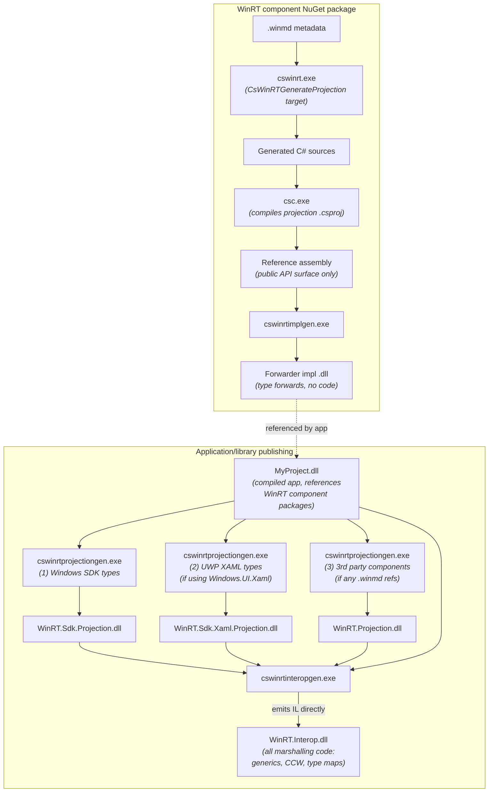
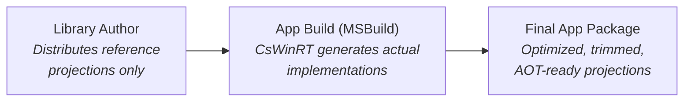

# CsWinRT 3.0 — Copilot instructions

## Project overview

**CsWinRT** (C#/WinRT) provides the Windows Runtime (WinRT) interop stack for C# applications. It replaces the built-in Windows Runtime interop that .NET dropped starting from .NET 5. CsWinRT 3.0 is a ground-up redesign targeting **.NET 10** with trimming and Native AOT as core architecture principles, built on the latest C# 14 language features and new .NET interop APIs.

### Core design principles

- **AOT-first**: all features must work and be fast on Native AOT. All vtables and CCW entries should be foldable by ILC into readonly data sections.
- **Trim-safe and trim-friendly**: all generated code is fully trimmable without user action.
- **Security**: all vtables and COM interface entries are in readonly data sections. All native object lifetime/concurrency issues from 2.x are addressed.
- **Performance**: minimal overhead marshalling, zero-allocation vtables, pre-initialized type hierarchies.
- **Modern C#**: targets .NET 10 / C# 14, uses `Span<T>` projections, `extension` types, `allows ref struct`, `static abstract` interface members, `file`-scoped types, etc.
- **No source generators at publish time**: heavy code generation is done by post-build CLI tools (not source generators), so IntelliSense is never impacted.

### Multi-targeting

CsWinRT 3.0 is fundamentally incompatible with CsWinRT 2.x. The .NET SDK uses the TFM revision number to select the version:

- `net10.0-windows10.0.22621.0` → CsWinRT 2.x
- `net10.0-windows10.0.22621.1` → CsWinRT 3.0

The `CSWINRT3_0` define constant is set when CsWinRT 3.0 is active.

> **Note:** The repository is in active migration from CsWinRT 2.x to 3.0. Not all code in the repo is actively used. Focus on the projects described below.

---

## Repository structure (CsWinRT 3.0 projects)

```
CsWinRT/
├── src/
│   ├── WinRT.Runtime2/                    # (1) Runtime library (WinRT.Runtime.dll)
│   ├── Authoring/
│   │   └── WinRT.SourceGenerator2/        # (2) Roslyn source generator + analyzers
│   ├── cswinrt/                           # (3) C++ code generator (cswinrt.exe)
│   ├── WinRT.Impl.Generator/              # (4) Impl/forwarder DLL generator (cswinrtimplgen.exe)
│   ├── WinRT.Projection.Generator/        # (5) Projection DLL generator (cswinrtprojectiongen.exe)
│   ├── WinRT.Interop.Generator/           # (6) Interop sidecar generator (cswinrtinteropgen.exe)
│   ├── WinRT.WinMD.Generator/             # (7) Component .winmd generator (cswinrtwinmdgen.exe)
│   ├── WinRT.Generator.Tasks/             # (8) MSBuild tasks for the build tools
│   └── WinRT.Sdk.Projection/              # (9) Precompiled Windows SDK projection builds
├── nuget/                                 # MSBuild .props/.targets for NuGet package
├── docs/                                  # Specifications and documentation
└── eng/                                   # Engineering/CI infrastructure
```

---

## Architecture overview



> **Precompiled SDK projections:** To speed up builds, the CsWinRT NuGet package includes precompiled `WinRT.Sdk.Projection.dll` and `WinRT.Sdk.Xaml.Projection.dll` binaries for all supported Windows SDK versions. When the CsWinRT version matches the target Windows SDK version (which is the normal case, except when using a Windows SDK preview), the projection generator skips regenerating these .dll-s entirely and uses the precompiled ones instead. This avoids the cost of running cswinrt.exe + Roslyn compilation for the entire Windows SDK on every publish.

---

## Why reference projections?

A key architectural decision in CsWinRT 3.0 is the move to **reference projections**. This adds some complexity to the build infrastructure (the impl generator, the projection generator, the multi-phase build pipeline), but it solves a fundamental ecosystem problem from CsWinRT 2.x:

### The problem with CsWinRT 2.x

With CsWinRT 2.x, projection implementations were baked directly into library `.dll` files. This created a real bottleneck: in order for an app to benefit from CsWinRT projection improvements, **every library it consumed also had to move to the new CsWinRT version**. App developers had to wait (sometimes a long time) and library authors often had to ship updates **solely** to pick up CsWinRT improvements, even when they had no functional changes of their own. Furthermore, we were effectively stuck supporting every historical API shape forever: removing or changing internal projection APIs could cause runtime crashes for existing projections, which meant meaningful optimizations were off the table.

### How CsWinRT 3.0 solves this

CsWinRT 3.0 moves all distributed projections to **reference projections**. Libraries now ship a lightweight **reference projection .dll** along with a forwarder .dll (this is needed to avoid issues related to strong-name signing of binaries). That reference projection is simply a CsWinRT-generated C# representation of the Windows Runtime API surface. It contains **no projection implementation logic**. The actual projection implementations are generated **at app build time** by CsWinRT.



**Why this matters:**

- **Apps update CsWinRT version independently**, no waiting on libraries
- **Libraries don't ship updates for CsWinRT version changes** — their reference projections remain stable
- **Libraries don't worry about consumer CsWinRT versions** — the forwarder .dll routes to whatever projection the app generates
- **Latest optimizations without ecosystem friction** — CsWinRT can evolve and improve projection APIs, even in minor releases, without breaking consumers
- **Faster fixes, smaller projections, and more flexibility**, all at the same time

This is the reason the build pipeline involves the "impl" generator (to produce forwarder .dll-s) and the projection generator (to produce the actual implementation .dll-s at app build time), rather than simply shipping pre-built projection .dll-s in NuGet packages.

## Why the interop generator?

On top of the reference projection model, CsWinRT 3.0 adds another post-build tool: the **interop generator** (`cswinrtinteropgen.exe`), which produces the `WinRT.Interop.dll` sidecar assembly. This tool exists for additional reasons beyond the ones that also apply to IL emission over C# source generation (see the _"Why IL emission (not C# source generation)?"_ paragraph in the interop generator section below).

One of the core goals of CsWinRT 3.0 is to be **fully AOT-compatible**, with all vtables and COM interface data for all objects being **fully pre-initialized at publish time**. To achieve this, we need to discover every type that could possibly be marshalled across the WinRT interop boundary, and generate all marshalling code for them in advance. A source generator could have done this too, but it would only have been able to analyze **one project at a time**. That per-project limitation causes two fundamental problems:

1. **Code duplication**: if multiple assemblies use the same generic instantiations (e.g. `IList<string>`, `IAsyncOperation<int>`), each project would generate its own copy of the marshalling stubs. This is a common and well-known problem with CsWinRT 2.x, leading to bloated binary sizes.
2. **Type map conflicts**: the .NET 10 interop type map APIs do not support registering multiple entries for the same key. If two assemblies both emitted and registered marshalling code for the same generic instantiation, the application would **fail at publish time** with duplicate key errors.

By running the interop generator at the very end of the build process (after all assemblies in the application have been compiled) the tool can **analyze the entire application domain at once**. It "sees the whole world": every assembly, every type, every generic instantiation used anywhere in the app. This lets it generate **deduplicated, optimized** marshalling code for exactly the set of types the application needs, with no duplication and no conflicts in the interop type map.

---

## Key MSBuild properties

| Property | Default | Description |
|----------|---------|-------------|
| `CsWinRTEnabled` | `true` | Master switch for CsWinRT processing |
| `CsWinRTGenerateProjection` | `true` | Run cswinrt.exe to generate C# projection code |
| `CsWinRTGenerateInteropAssembly2` | auto (`true` for Exe/WinExe, or Library with `PublishAot=true`) | Generate interop assemblies at publish time |
| `CsWinRTGenerateReferenceProjection` | `false` | Generate reference-only projections (for NuGet packages) |
| `CsWinRTComponent` | `false` | Enable Windows Runtime component authoring mode |
| `CsWinRTUseWindowsUIXamlProjections` | `false` | Use UWP XAML (`Windows.UI.Xaml`) instead of WinUI (`Microsoft.UI.Xaml`) |
| `CsWinRTMergeReferencedActivationFactories` | `false` | Merge activation factories from referenced components |

---

## Project details

### 1. WinRT.Runtime (`src/WinRT.Runtime2/`)

The runtime library (`WinRT.Runtime.dll`) provides all common infrastructure for Windows Runtime interop. It is referenced by all other CsWinRT components and by consuming applications.

**Project settings:**

- **Target**: `net10.0`, C# 14, `AllowUnsafeBlocks`, `DisableRuntimeMarshalling`
- **Root namespace**: `WindowsRuntime`
- **Assembly name**: `WinRT.Runtime` (fixed name: other components depend on it, e.g. the UWP XAML compiler)
- **Warnings as errors**: release only. `EnforceCodeStyleInBuild` enabled, `AnalysisLevelStyle` = `latest-all`.
- **Strong-name signed** with `key.snk`
- **AOT compatible**: `IsAotCompatible = true`
- **Reference assembly**: the project is built twice for NuGet packaging. With `CsWinRTBuildReferenceAssembly=true`, it produces a reference assembly (for `ref\net10.0\` in the NuGet) that strips all private implementation detail types and members. The normal build produces the full implementation assembly (for `lib\net10.0\`) and defines `WINDOWS_RUNTIME_IMPLEMENTATION_ASSEMBLY`; the reference assembly build defines `WINDOWS_RUNTIME_REFERENCE_ASSEMBLY` instead. Stripping is driven primarily by the `[WindowsRuntimeImplementationOnlyMember]` attribute (a `[Conditional("WINDOWS_RUNTIME_REFERENCE_ASSEMBLY")]` marker on top-level types) plus an MSBuild target that removes any source file containing that attribute, any file with a top-of-file `#define WINDOWS_RUNTIME_IMPLEMENTATION_ONLY_FILE`, and entire implementation-only folders (e.g. `ABI\`, `NativeObjects\`, most `InteropServices\` subfolders). Method bodies remaining in the reference assembly are stubbed with `throw null`. This replaces the previous approach of marking implementation details with `[Obsolete]` and `[EditorBrowsable(Never)]` attributes.

**Directory structure:**

```
WinRT.Runtime2/
├── WindowsRuntimeObject.cs          # Base class for ALL projected runtime classes
├── WindowsRuntimeInspectable.cs     # Fallback type for unknown native objects
├── ABI/                             # ABI type mappings (managed ↔ native)
│   ├── System/                      # Primitives, String, Uri, DateTimeOffset, collections, etc.
│   ├── Windows.Foundation/          # Foundation types (Point, Rect, Size, etc.)
│   └── WindowsRuntime.InteropServices/  # Bindable adapters
├── Attributes/                      # Public marker attributes (e.g. [WindowsRuntimeClassName])
├── InteropServices/                 # Core interop infrastructure (~456 files)
│   ├── Activation/                  # Object activation factories and helpers
│   ├── AsyncInfo/                   # Async operation marshalling
│   ├── Callbacks/                   # ComWrappers callbacks
│   ├── Collections/                 # Collection adapters (IList↔IVector, IDictionary↔IMap, etc.)
│   ├── Events/                      # Event source infrastructure (EventSource<T>, tokens)
│   ├── Exceptions/                  # Exception ↔ HRESULT marshalling
│   ├── InteropDllImports/           # P/Invoke declarations
│   ├── Marshalers/                  # Type marshallers (string, delegate, value type, etc.)
│   ├── Marshalling/                 # High-level marshalling APIs (WindowsRuntimeObjectMarshaller, etc.)
│   ├── ObjectReference/             # Native object lifetime (WindowsRuntimeObjectReference hierarchy)
│   ├── Platform/                    # Platform types (HRESULT, HSTRING, etc.)
│   ├── ProjectionImpls/             # Built-in interface implementations (IStringable, IPropertyValue, etc.)
│   ├── TypeMapGroups/               # Type mapping group markers for ComWrappers
│   ├── TypeMapInfo/                 # Type metadata caching
│   ├── Vtables/                     # COM vtable struct definitions (37 vtable types)
│   └── WeakReferences/              # Weak reference support
├── NativeObjects/                   # Managed wrappers for native Windows Runtime objects (collections, async, etc.)
├── Windows.Foundation/              # Manually projected foundation types
├── Windows.Foundation.Collections/  # Collection interfaces (IObservableVector, IObservableMap, etc.)
├── Windows.Storage.Streams/         # Manually projected stream types
├── Windows.UI.Xaml.Interop/         # Manually projected XAML interop types
├── Xaml.Attributes/                 # XAML-related attribute types
├── Properties/                      # Exception messages and configuration (e.g. feature switches)
└── Exceptions/                      # Exception types
```

**Key types:**

| Type | Purpose |
|------|---------|
| `WindowsRuntimeObject` | Abstract base class for all projected runtime classes. Implements `IDynamicInterfaceCastable`, `IUnmanagedVirtualMethodTableProvider`, `ICustomQueryInterface`. Manages native COM pointer lifetime, lazy IInspectable caching, and interface resolution. |
| `WindowsRuntimeObjectReference` | Abstract base for native COM object lifetime management. Hierarchy includes `FreeThreadedObjectReference` (agile) and `ContextAwareObjectReference` (thread-affine). Manages `AddRef`/`Release`, GC memory pressure, reference tracker support. |
| `WindowsRuntimeComWrappers` | Singleton `ComWrappers` subclass. Uses thread-local storage for fast-path marshalling. |
| `WindowsRuntimeComWrappersMarshal` | High-level API: `TryUnwrapObjectReference()`, `IsReferenceToManagedObject()`, etc. |
| `WindowsRuntimeObjectMarshaller` | Marshals `object` ↔ `IInspectable*`. Core `ConvertToUnmanaged`/`ConvertToManaged` methods. |
| `EventSource<T>` | Base event source adapter for Windows Runtime events. Specialized subclasses for `EventHandler`, `EventHandler<T>`, `TypedEventHandler<TSender, TResult>`. |
| Collection adapters (`IListAdapter<T>`, etc.) | Bridge .NET collections (`IList<T>`, `IDictionary<K,V>`, etc.) to Windows Runtime collections (`IVector<T>`, `IMap<K,V>`, etc.) |

**Key patterns:**

- **Unsafe code**: extensive use of `void*` for COM pointers, `delegate* unmanaged[MemberFunction]<...>` for vtable function pointers, `stackalloc`, `fixed` statements.
- **C# 14 features**: `extension(Type)` syntax for explicit extensions, `allows ref struct` constraints, `static abstract` interface members, `file`-scoped types, primary constructors.
- **Vtable structs**: all vtables are `[StructLayout(LayoutKind.Sequential)]` structs with unmanaged function pointer fields, matching COM vtable memory layout exactly.
- **Reference counting**: mimics COM `AddRef`/`Release` with managed lease counts and GC memory pressure tracking.
- **T4 templates**: 6 `.tt` files generate constants (`HRESULT` codes, interface IIDs, XAML class names) and specialized marshallers (blittable array types).
- **Feature switches**: opt-in/opt-out runtime features are controlled via `[FeatureSwitchDefinition]`-annotated properties in `WindowsRuntimeFeatureSwitches` (`Properties/WindowsRuntimeFeatureSwitches.cs`). Each switch is backed by an `AppContext` configuration property (e.g. `CSWINRT_ENABLE_MANIFEST_FREE_ACTIVATION`) and wired to an MSBuild property (e.g. `CsWinRTEnableManifestFreeActivation`) in `nuget/Microsoft.Windows.CsWinRT.targets`, which emits `RuntimeHostConfigurationOption` items with `Trim="true"`. This lets ILLink (trimming) and ILC (Native AOT) treat the switch values as constants and dead-code-eliminate all code behind disabled switches, making opt-in features fully pay-for-play.

**Types projected in WinRT.Runtime:**

Not all WinRT types are generated automatically by `cswinrt.exe` into SDK projection assemblies. `WinRT.Runtime` contains two categories of types that require special handling:

#### Custom-mapped types

These are built-in C#/.NET types that are mapped to WinRT types. Because the .NET type already exists in the BCL (and is not owned by CsWinRT), it cannot be "projected" in the usual sense. Instead, CsWinRT associates the necessary WinRT metadata with it via attributes such as `[WindowsRuntimeMappedMetadata]` and dedicated ABI marshalling code in the `ABI/System/` directory. Some of these types map to identically-named WinRT types (e.g. `int` ↔ `Int32`, `Guid` ↔ `Guid`), while others map to a different WinRT type entirely. The `EventHandler` delegate is especially noteworthy: the non-generic `System.EventHandler` is handled as a special case (see `ABI/System/EventHandler.cs`), while `System.EventHandler<TEventArgs>` maps to `Windows.Foundation.EventHandler<T>`, and `System.EventHandler<TSender, TEventArgs>` (a two-parameter generic delegate projected by CsWinRT) maps to `Windows.Foundation.TypedEventHandler<TSender, TResult>`.

The following table lists all custom-mapped types where the .NET type maps to a **differently-named** WinRT type:

| .NET type | WinRT type |
|-----------|-----------|
| `System.DateTimeOffset` | `Windows.Foundation.DateTime` |
| `System.Exception` | `Windows.Foundation.HResult` |
| `System.IDisposable` | `Windows.Foundation.IClosable` |
| `System.Nullable<T>` | `Windows.Foundation.IReference<T>` |
| `System.TimeSpan` | `Windows.Foundation.TimeSpan` |
| `System.EventHandler<TSender, TEventArgs>` | `Windows.Foundation.TypedEventHandler<TSender, TResult>` |
| `System.Uri` | `Windows.Foundation.Uri` |
| `System.Type` | `Windows.UI.Xaml.Interop.TypeName` |
| `System.IServiceProvider` | `Microsoft.UI.Xaml.IXamlServiceProvider` |
| `System.ComponentModel.INotifyPropertyChanged` | `Microsoft.UI.Xaml.Data.INotifyPropertyChanged` |
| `System.ComponentModel.PropertyChangedEventArgs` | `Microsoft.UI.Xaml.Data.PropertyChangedEventArgs` |
| `System.ComponentModel.PropertyChangedEventHandler` | `Microsoft.UI.Xaml.Data.PropertyChangedEventHandler` |
| `System.ComponentModel.INotifyDataErrorInfo` | `Microsoft.UI.Xaml.Data.INotifyDataErrorInfo` |
| `System.ComponentModel.DataErrorsChangedEventArgs` | `Microsoft.UI.Xaml.Data.DataErrorsChangedEventArgs` |
| `System.Windows.Input.ICommand` | `Microsoft.UI.Xaml.Input.ICommand` |
| `System.Collections.IEnumerable` | `Microsoft.UI.Xaml.Interop.IBindableIterable` |
| `System.Collections.IEnumerator` | `Microsoft.UI.Xaml.Interop.IBindableIterator` |
| `System.Collections.IList` | `Microsoft.UI.Xaml.Interop.IBindableVector` |
| `System.Collections.Specialized.INotifyCollectionChanged` | `Microsoft.UI.Xaml.Interop.INotifyCollectionChanged` |
| `System.Collections.Specialized.NotifyCollectionChangedAction` | `Microsoft.UI.Xaml.Interop.NotifyCollectionChangedAction` |
| `System.Collections.Specialized.NotifyCollectionChangedEventArgs` | `Microsoft.UI.Xaml.Interop.NotifyCollectionChangedEventArgs` |
| `System.Collections.Specialized.NotifyCollectionChangedEventHandler` | `Microsoft.UI.Xaml.Interop.NotifyCollectionChangedEventHandler` |
| `System.Collections.Generic.IEnumerable<T>` | `Windows.Foundation.Collections.IIterable<T>` |
| `System.Collections.Generic.IEnumerator<T>` | `Windows.Foundation.Collections.IIterator<T>` |
| `System.Collections.Generic.KeyValuePair<K, V>` | `Windows.Foundation.Collections.IKeyValuePair<K, V>` |
| `System.Collections.Generic.IReadOnlyDictionary<K, V>` | `Windows.Foundation.Collections.IMapView<K, V>` |
| `System.Collections.Generic.IDictionary<K, V>` | `Windows.Foundation.Collections.IMap<K, V>` |
| `System.Collections.Generic.IReadOnlyList<T>` | `Windows.Foundation.Collections.IVectorView<T>` |
| `System.Collections.Generic.IList<T>` | `Windows.Foundation.Collections.IVector<T>` |
| `System.Numerics.Matrix3x2` | `Windows.Foundation.Numerics.Matrix3x2` |
| `System.Numerics.Matrix4x4` | `Windows.Foundation.Numerics.Matrix4x4` |
| `System.Numerics.Plane` | `Windows.Foundation.Numerics.Plane` |
| `System.Numerics.Quaternion` | `Windows.Foundation.Numerics.Quaternion` |
| `System.Numerics.Vector2` | `Windows.Foundation.Numerics.Vector2` |
| `System.Numerics.Vector3` | `Windows.Foundation.Numerics.Vector3` |
| `System.Numerics.Vector4` | `Windows.Foundation.Numerics.Vector4` |

> **Note:** For types that map to `Microsoft.UI.Xaml.*` WinRT types, when CsWinRT is in `Windows.UI.Xaml.*` mode (`CsWinRTUseWindowsUIXamlProjections = true`) and a corresponding UWP XAML type exists, the mapping switches to that type instead. For example, `System.Windows.Input.ICommand` maps to `Windows.UI.Xaml.Input.ICommand` rather than `Microsoft.UI.Xaml.Input.ICommand`.

The full mapping table (including identical-name mappings for primitives) is in `src/WinRT.Interop.Generator/Helpers/TypeMapping.cs`.

#### Manually-projected types

These are WinRT types that are defined directly in `WinRT.Runtime` rather than being auto-generated by `cswinrt.exe` into SDK projection assemblies. A type is manually projected when it requires customized marshalling support, or when it is referenced by additional infrastructure code that lives in `WinRT.Runtime`. For example:

- **Generic collection interfaces** (`IEnumerable<T>`, `IList<T>`, `IDictionary<K,V>`, etc.) are here so that supporting adapter code (e.g. `IListAdapter<T>`, `IEnumerableMethods<T>`) and native object wrappers can live alongside them and be consumed by both projections and the interop generator.
- **Async interfaces** (`IAsyncOperation<T>`, `IAsyncActionWithProgress<T>`, etc.) and their associated delegates are here to provide the async infrastructure (`AsyncInfo`, `EventSource<T>` specializations) that bridges WinRT async patterns to `Task`.
- **Observable collection interfaces** (`IObservableVector<T>`, `IObservableMap<K,V>`) and their event handler delegates (`VectorChangedEventHandler<T>`, `MapChangedEventHandler<K,V>`) are here for event source wiring.
- **Foundation types** such as `IStringable`, `Point`, `Rect`, `Size`, `PropertyType`, and `EventRegistrationToken` are here because they are referenced by marshalling infrastructure or vtable definitions within `WinRT.Runtime`.

Some of these types — particularly the bindable collection interfaces (`IEnumerable`, `IList`) and XAML-related types — have **different IIDs and/or runtime class names** depending on whether `Windows.UI.Xaml.*` (UWP XAML) or `Microsoft.UI.Xaml.*` (WinUI) support is being used (controlled by the `CsWinRTUseWindowsUIXamlProjections` MSBuild property). This requires further special handling in both the generated projection code and the interop generator to ensure that the correct marshalling and metadata info is associated with them at publish time.

### 2. WinRT.SourceGenerator2 (`src/Authoring/WinRT.SourceGenerator2/`)

A Roslyn incremental source generator and diagnostic analyzer package. Runs at **design time** (IntelliSense) and **build time**. It is intentionally lightweight — heavy codegen is deferred to the post-build CLI tools.

**Project settings:**

- **Target**: `net10.0`, C# 14, `IsRoslynComponent = true`
- **Root namespace**: `WindowsRuntime.SourceGenerator`
- **Assembly name**: `WinRT.SourceGenerator2`
- **Dependency**: `Microsoft.CodeAnalysis.CSharp` 5.0.0

**Three source generators:**

| Generator | What It Generates |
|-----------|-------------------|
| `AuthoringExportTypesGenerator` | Activation factory infrastructure for Windows Runtime component authoring. Emits `ManagedExports.g.cs` (with `GetActivationFactory()` method) and `NativeExports.g.cs` (with `DllGetActivationFactory()` entry point for Native AOT). Triggered when `CsWinRTComponent = true`. |
| `CustomPropertyProviderGenerator` | `ICustomPropertyProvider` implementations for XAML data binding. Annotate types with `[GeneratedCustomPropertyProvider]` to auto-generate property accessors. Supports both UWP and WinUI XAML. |
| `TypeMapAssemblyTargetGenerator` | `[TypeMapAssemblyTarget]` assembly attributes for runtime type mapping in AOT scenarios. Discovers referenced Windows Runtime assemblies and registers them with the three type map groups: `WindowsRuntimeComWrappersTypeMapGroup`, `WindowsRuntimeMetadataTypeMapGroup`, `DynamicInterfaceCastableImplementationTypeMapGroup`. |

**Four diagnostic analyzers** producing 9 diagnostics (all errors, IDs `CSWINRT2000`–`CSWINRT2008`):

Validate `[GeneratedCustomPropertyProvider]` usage:

- `CSWINRT2000`: Invalid target type (must be non-abstract, non-static class/struct)
- `CSWINRT2001`: Missing `partial` modifier on target type or containing type
- `CSWINRT2002`: `ICustomPropertyProvider` interface not available (need WinUI or UWP reference)
- `CSWINRT2003`: Type already implements `ICustomPropertyProvider` members
- `CSWINRT2004`–`CSWINRT2008`: Invalid attribute arguments (null names, missing properties/indexers, static indexers)

### 3. cswinrt.exe (`src/cswinrt/`)

A **C++ command-line tool** that reads `.winmd` metadata files and generates C# projection source code for Windows Runtime types. It uses the [WinMD NuGet package](http://aka.ms/winmd/nuget) for parsing [ECMA-335 metadata](http://www.ecma-international.org/publications/standards/Ecma-335.htm) files.

**Key files:**

| File | Purpose |
|------|---------|
| `main.cpp` | Entry point: parses args, loads metadata, orchestrates parallel namespace generation |
| `settings.h` | Command-line option definitions (`--input`, `--output`, `--include`, `--exclude`, `--reference_projection`, etc.) |
| `code_writers.h` | Primary code generation logic (~456 KB). Contains `write_class()`, `write_interface()`, `write_struct()`, `write_enum()`, `write_delegate()` and their ABI counterparts |
| `type_writers.h` | Type name writing utilities, generic argument tracking |
| `helpers.h` | Type categorization utilities (`is_static()`, `is_type_blittable()`, `get_default_interface()`, etc.) |
| `strings/` | Embedded C# code injected into output (additions for specific namespaces) |

**Input/Output:**

```
cswinrt.exe --input <.winmd files/dirs> --output <dir> [--include/--exclude prefixes]
            [--reference_projection] [--component] [--internal] [--embedded]
```

**Generates two layers of C# code per Windows Runtime type:**

1. **Projected types** (public API): the user-facing C# classes, interfaces, structs, enums, and delegates that developers use directly. Runtime classes inherit `WindowsRuntimeObject`.
2. **ABI layer** (`namespace ABI.{Namespace}`): internal marshalling infrastructure — vtable definitions (structs with unmanaged function pointers), interface method implementations, marshaller classes.

**Namespace additions** (`strings/additions/`): extra C# code injected into specific namespaces (e.g. `Color.FromArgb()` for `Windows.UI`, XAML struct helpers for `Thickness`, `CornerRadius`, `GridLength`, etc.).

**Internal interop interfaces** (`WindowsRuntime.Internal.idl`): a manually authored IDL file defining Windows SDK COM interop interfaces (e.g. `IDisplayInformationStaticsInterop`, `IPrintManagerInterop`) that are not included in standard `.winmd` metadata. This IDL is compiled to a `.winmd` that is bundled in the CsWinRT NuGet package and passed as additional input to cswinrt.exe when building Windows SDK projections. The `[ProjectionInternal]` attribute on each interface causes all generated projection code to be `internal`. User-friendly extension methods in `strings/ComInteropExtensions.cs` wrap these internal projections, exposing discoverable APIs on the associated projected types (e.g. `DisplayInformation.GetForWindow(hwnd)`, `PrintManager.ShowPrintUIForWindowAsync(hwnd)`).

### 4. Impl generator (`src/WinRT.Impl.Generator/`)

A **.NET CLI tool** (`cswinrtimplgen.exe`) published as a **Native AOT** binary. Generates **forwarder/impl assemblies** that contain only type forwards (no actual code).

**Project settings:**

- **Target**: `net10.0`, `PublishAot = true`, `DisableRuntimeMarshalling`
- **Assembly name**: `cswinrtimplgen`
- **Dependencies**: `AsmResolver.DotNet` (IL manipulation), `ConsoleAppFramework` (CLI)

**Purpose:** Projection `.dll` files in NuGet packages don't need to be updated for new CsWinRT versions. They contain no actual code — just type forwards to the merged projection `.dll` that is generated at app publish time.

**Type forward routing:**

| Input Assembly | Forwards To |
|----------------|-------------|
| `Microsoft.Windows.SDK.NET` | `WinRT.Sdk.Projection` |
| `Microsoft.Windows.UI.Xaml` | `WinRT.Sdk.Xaml.Projection` |
| Any other | `WinRT.Projection` |

**How it works:**

1. Loads the built output assembly using AsmResolver
2. Creates a new empty assembly (the "impl" assembly)
3. Copies well-known assembly attributes (version, debug info, etc.)
4. Emits `[TypeForwarder]` entries for all public top-level types, routing to the appropriate projection assembly
5. Optionally signs with a strong-name key

### 5. Projection generator (`src/WinRT.Projection.Generator/`)

A **.NET CLI tool** (`cswinrtprojectiongen.exe`) published as a **Native AOT** binary. Takes `.winmd` files as input, invokes `cswinrt.exe` to generate C# sources, then compiles them into a projection `.dll` using the Roslyn APIs.

**Project settings:**

- **Target**: `net10.0`, `PublishAot = true`, `DisableRuntimeMarshalling`
- **Assembly name**: `cswinrtprojectiongen`
- **Dependencies**: `AsmResolver.DotNet`, `ConsoleAppFramework`, `Microsoft.CodeAnalysis.CSharp` (Roslyn)

**Three projection modes:**

| Mode | Output Assembly | Content |
|------|----------------|---------|
| Windows SDK | `WinRT.Sdk.Projection.dll` | Core Windows Runtime types (`Windows.*`, except XAML). Flags: `--windows-sdk-only true` |
| UWP XAML | `WinRT.Sdk.Xaml.Projection.dll` | `Windows.UI.Xaml.*` types (UWP XAML framework). Flags: `--windows-sdk-only true --windows-ui-xaml-projection true` |
| 3rd Party / Merged | `WinRT.Projection.dll` | All non-Windows-SDK types (WindowsAppSDK, WinUI 3, custom components). Default mode. |

**Three-phase pipeline:**

1. **Process References**: load reference assemblies via AsmResolver, generate `.rsp` response file with namespace filters
2. **Generate Sources**: invoke `cswinrt.exe @response.rsp` to produce C# files
3. **Emit Assembly**: parse generated `.cs` files with Roslyn, compile to `.dll` with `CSharpCompilation`, emit with embedded debug info

### 6. Interop generator (`src/WinRT.Interop.Generator/`)

A **.NET CLI tool** (`cswinrtinteropgen.exe`) published as a **Native AOT** binary. This is the most complex build tool — it analyzes all application assemblies and produces the `WinRT.Interop.dll` sidecar containing all marshalling code.

**Project settings:**

- **Target**: `net10.0`, C# 14, `PublishAot = true`, `DisableRuntimeMarshalling`
- **Assembly name**: `cswinrtinteropgen`
- **Dependencies**: `AsmResolver.DotNet`, `ConsoleAppFramework`, `CommunityToolkit.HighPerformance`, `System.Numerics.Tensors`
- **Security**: Control Flow Guard enabled, `IlcDehydrate = false` for lower memory usage

**Why IL emission (not C# source generation)?**

There's two reasons for this:
- The interop generator has to emit IL so it can access non-public types from referenced assemblies using `[IgnoresAccessChecksTo]` (this is not expressible in C#), so that all types anywhere can "automatically" get marshalling support without any work needed from developers (e.g. no need to mark those types as `partial` to have the source generator from CsWinRT 2.x run on them and emit marshalling code directly in their assembly).
- Implementing this logic as a source generator would both be incomplete (there's no way to detect everything we can detect by analyzing IL metadata directly), and also **extremely** expensive. The latter is a known issue with the source generator in CsWinRT 2.x, which causes significant slowdown in the IDE and IntelliSense performance when working on larger projects.

**What it generates in `WinRT.Interop.dll`:**

| Category | Description |
|----------|-------------|
| Generic instantiation marshalling | For each `IList<T>`, `IDictionary<K,V>`, `IAsyncOperation<T>`, etc. used in the app: vtable types, native object wrappers, method implementations, interface impls, ComWrappers callbacks, marshaller attributes, proxy types |
| SZ array type marshalling | Marshalling stubs for single-dimensional array parameters |
| User-defined type CCW support | COM Callable Wrapper infrastructure for user types implementing Windows Runtime interfaces: interface entries, ComWrappers marshaller attributes, proxy types, type map attributes |
| Special XAML types | Marshalling for XAML-specific types |
| Type hierarchy lookup | Pre-initialized type hierarchy for the entire application domain |
| Interface mapping | Dynamic cast interface mapping for all Windows Runtime types |
| `[IgnoresAccessChecksTo]` | Assembly-level attributes to bypass accessibility for non-public types |

**Two-phase architecture:**

1. **Discover phase**: loads all input assemblies in parallel, scans for Windows Runtime types, generic instantiations, user-defined types implementing Windows Runtime interfaces. Uses visitor pattern (`AllGenericTypesVisitor`, `AllSzArrayTypesVisitor`).
2. **Emit phase**: creates `WinRT.Interop.dll` via AsmResolver. Uses a two-pass IL generation approach (stub creation → rewriting via `InteropMethodRewriter`), then applies IL fixups.

**Debug repro support**: can capture all inputs into a `.zip` file for reproducible debugging.

### 7. WinMD generator (`src/WinRT.WinMD.Generator/`)

A **.NET CLI tool** (`cswinrtwinmdgen.exe`) published as a **Native AOT** binary. Generates a `.winmd` metadata file from a compiled C# component assembly, allowing developers to author Windows Runtime components in C#. This is a port and restructuring of the previous WinMD generator from CsWinRT 2.x, which was implemented as a Roslyn source generator. Moving it to a post-build CLI tool keeps it consistent with the other CsWinRT 3.0 build tools (interop, impl, projection generators) and removes the design-time/IntelliSense overhead of analyzing the entire component at every keystroke. It also addresses a more fundamental issue with the 2.x design: the generator produced a `.winmd` file **on disk**, but doing arbitrary file I/O from a Roslyn source generator is explicitly unsupported (source generators are only allowed to contribute additional source code to the compilation). The 2.x approach was therefore technically not even supported. The 3.0 post-build tool runs as a normal MSBuild step where file I/O is the expected output mechanism.

**Project settings:**

- **Target**: `net10.0`, C# 14, `PublishAot = true`, `DisableRuntimeMarshalling`
- **Root namespace**: `WindowsRuntime.WinMDGenerator`
- **Assembly name**: `cswinrtwinmdgen`
- **Dependencies**: `AsmResolver.DotNet`, `ConsoleAppFramework`
- **Security**: Control Flow Guard enabled, `IlcResilient = false`

**Directory structure:**

```
WinRT.WinMD.Generator/
├── Program.cs            # Entry point (ConsoleAppFramework dispatch to WinMDGenerator.Run)
├── Attributes/           # CLI argument metadata attributes
├── Discovery/            # Assembly analysis to discover authored Windows Runtime types
├── Errors/               # WellKnownWinMDException + UnhandledWinMDException (CSWINRTWINMDGEN error IDs)
├── Extensions/           # AsmResolver helper extensions
├── Generation/           # Top-level driver (WinMDGenerator), CLI args, discovery state
├── Helpers/              # Type mapping and utility helpers
├── Models/               # Intermediate data models
├── References/           # Reference assembly resolution
└── Writers/              # Emits the .winmd file via AsmResolver
```

**CLI parameters** (defined on `WinMDGeneratorArgs`):

| Argument | Purpose |
|----------|---------|
| `--input-assembly-path` | Compiled component .dll to analyze |
| `--reference-assembly-paths` | Reference .dll paths for type resolution |
| `--output-winmd-path` | Output `.winmd` file path |
| `--assembly-version` | Assembly version stamped into the generated WinMD |
| `--use-windows-ui-xaml-projections` | Use UWP XAML (`Windows.UI.Xaml`) instead of WinUI |

**How it integrates with the build:**

- Wired into MSBuild via `nuget/Microsoft.Windows.CsWinMD.Generator.targets` (imported by `Microsoft.Windows.CsWinRT.targets` when `CsWinRTComponent == true`)
- Invoked through the `RunCsWinRTWinMDGenerator` MSBuild task (in `WinRT.Generator.Tasks`)
- Runs after `CoreCompile` (it needs the compiled .dll), gated on `CsWinRTComponent == true` and `DesignTimeBuild != true`
- Output is `$(IntermediateOutputPath)$(AssemblyName).winmd`, then copied to `$(TargetDir)` by the authoring targets and packaged into the component's NuGet

### 8. Generator tasks (`src/WinRT.Generator.Tasks/`)

MSBuild task wrappers that bridge the MSBuild build system with the CLI tools above.

**Project settings:**

- **Target**: `netstandard2.0` (for MSBuild compatibility)
- **Dependency**: `Microsoft.Build.Utilities.Core`

**Four tasks:**

| Task Class | Tool | Purpose |
|------------|------|---------|
| `RunCsWinRTForwarderImplGenerator` | `cswinrtimplgen.exe` | Generate forwarder/impl assemblies |
| `RunCsWinRTMergedProjectionGenerator` | `cswinrtprojectiongen.exe` | Generate merged projection assemblies |
| `RunCsWinRTInteropGenerator` | `cswinrtinteropgen.exe` | Generate interop sidecar assembly |
| `RunCsWinRTWinMDGenerator` | `cswinrtwinmdgen.exe` | Generate component `.winmd` metadata |

All tasks extend `ToolTask`, generate response files for their respective CLI tools, and support architecture selection (`win-x86`, `win-x64`, `win-arm64`).

### 9. SDK projection builds (`src/WinRT.Sdk.Projection/`)

A build project (not a tool) used during **official CsWinRT builds** to produce precompiled `WinRT.Sdk.Projection.dll` and `WinRT.Sdk.Xaml.Projection.dll` for each supported Windows SDK version. These precompiled .dll-s are bundled into the CsWinRT NuGet package so that consumers don't have to regenerate the entire Windows SDK projection on every publish (as described in the architecture overview).

**Project settings:**

- **Target**: `net10.0`, `IsAotCompatible`, `DisableRuntimeMarshalling`
- **Assembly name**: `WinRT.Sdk.Projection` (or `WinRT.Sdk.Xaml.Projection` when `WindowsSdkXaml=true`)
- Disables `CsWinRTGenerateProjection` and `CsWinRTGenerateInteropAssembly2` (it builds the projection itself)

**How it works:**

- The target Windows SDK version is passed via `/p:WindowsSdkBuild=XXXXX` (e.g. `26100`)
- Downloads `Microsoft.Windows.SDK.Contracts` NuGet package to get the `.winmd` files for that SDK version
- Invokes `cswinrtprojectiongen.exe` (via the `RunCsWinRTMergedProjectionGenerator` MSBuild task) with `WindowsSdkOnly=true` to produce the projection .dll
- Output goes to a per-SDK-version subdirectory (`bin/{Configuration}/{WindowsSdkBuild}/`)
- Built twice per SDK version: once for the base projection (`WinRT.Sdk.Projection.dll`) and once with `WindowsSdkXaml=true` for the XAML projection (`WinRT.Sdk.Xaml.Projection.dll`)

---

## NuGet package build pipeline (`nuget/`)

The MSBuild integration is orchestrated through several `.props` and `.targets` files:

| File | Role |
|------|------|
| `Microsoft.Windows.CsWinRT.props` | Initial setup: sets `CsWinRTPath`, `CsWinRTExe`, `UsingCsWinRT3` flag |
| `Microsoft.Windows.CsWinRT.BeforeMicrosoftNetSdk.targets` | Pre-SDK configuration: reference projection mode, activation factory merging, stub exe setup |
| `Microsoft.Windows.CsWinRT.targets` | Main pipeline: projection generation (cswinrt.exe), reference setup, compilation integration |
| `Microsoft.Windows.CsWinRT.CsWinRTGen.targets` | Post-build tools: interop generation, impl generation, merged projection generation |
| `Microsoft.Windows.CsWinRT.Authoring.targets` | Windows Runtime component authoring: managed DLL output, WinMD generation, NuGet packaging |
| `Microsoft.Windows.CsWinRT.Authoring.Transitive.targets` | Transitive target rules for component consumers |
| `Microsoft.Windows.CsWinMD.Generator.targets` | Component `.winmd` generation: invokes `cswinrtwinmdgen.exe` after `CoreCompile` (only when `CsWinRTComponent == true`) |

---

## Code style and conventions

### C# projects

- **Language version**: C# 14.0 (`LangVersion` = `14.0` or `preview`)
- **Nullable reference types**: enabled everywhere
- **Unsafe code**: allowed in all projects (required for COM interop)
- **Runtime marshalling**: disabled (`DisableRuntimeMarshalling = true`) in runtime and build tools
- **Warnings as errors**: release builds only (`TreatWarningsAsErrors` + `CodeAnalysisTreatWarningsAsErrors`)
- **Code style enforcement**: `EnforceCodeStyleInBuild = true`, `AnalysisLevelStyle = latest-all`
- **Compiler strict mode**: `<Features>strict</Features>` in all projects
- **XML documentation**: generated for all projects
- **`SkipLocalsInit`**: enabled in runtime and build tools for performance
- **Suppressed warnings**: `CS8500` (ref safety in unsafe contexts), `AD0001` (analyzer crashes)
- **Strong-name signing**: all assemblies signed with `src/WinRT.Runtime2/key.snk`

### C++ project (cswinrt)

- Warnings treated as errors (`TreatWarningAsError = true`)
- Uses precompiled headers (`pch.h`/`pch.cpp`)
- Character set: Unicode
- Subsystem: Console

### Naming conventions

- C# namespaces follow the `WindowsRuntime.*` pattern (root namespace: `WindowsRuntime`)
  - `WindowsRuntime.InteropServices` for interop infrastructure
  - `WindowsRuntime.SourceGenerator` for the source generator
  - `WindowsRuntime.ImplGenerator`, `WindowsRuntime.ProjectionGenerator`, `WindowsRuntime.InteropGenerator`, `WindowsRuntime.WinMDGenerator` for build tools
- ABI types live under `ABI.{OriginalNamespace}` (e.g., `ABI.System.Collections.Generic`)
- CLI tool assembly names are short: `cswinrt`, `cswinrtimplgen`, `cswinrtprojectiongen`, `cswinrtinteropgen`, `cswinrtwinmdgen`
- C# keywords in generated identifiers are escaped with `@` prefix

### Build tool patterns

All four .NET build tools (`cswinrtimplgen`, `cswinrtprojectiongen`, `cswinrtinteropgen`, `cswinrtwinmdgen`) share common patterns:

- Published as **Native AOT** self-contained binaries for fast startup
- Use **ConsoleAppFramework** for CLI argument parsing
- Accept a **response file** (`.rsp`) as their primary input
- Use **AsmResolver.DotNet** for IL reading/writing
- Follow the same error handling pattern:
  - `WellKnown*Exception` for expected errors (with error IDs like `CSWINRTIMPLGEN0001`)
  - `Unhandled*Exception` for unexpected errors (suggests opening a GitHub issue)
  - `CommandLineArgumentNameAttribute` maps properties to CLI flag names
- Security hardening: Control Flow Guard, `IlcResilient = false` (fail on unresolved assemblies)

### Error ID ranges

| Project | Error ID Pattern | Range |
|---------|-----------------|-------|
| Source Generator | `CSWINRT2xxx` | `CSWINRT2000`–`CSWINRT2008` |
| Impl Generator | `CSWINRTIMPLGENxxxx` | `0001`–`0010`, `9999` |
| Projection Generator | `CSWINRTPROJECTIONGENxxxx` | `0001`–`0008`, `9999` |
| Interop Generator | `CSWINRTINTEROPGENxxxx` | Various, `9999` |
| WinMD Generator | `CSWINRTWINMDGENxxxx` | `0001`–`0007` |

---

## Key technical concepts

### COM interop model

CsWinRT 3.0 uses .NET's `ComWrappers` API for all COM interop:

- **RCW (Runtime Callable Wrapper)**: managed wrapper around native COM objects. Projected runtime classes inherit `WindowsRuntimeObject`, which holds a `WindowsRuntimeObjectReference` wrapping the native `IInspectable*` pointer.
- **CCW (COM Callable Wrapper)**: native COM representation of managed objects. The interop generator creates interface entry tables and vtable implementations for user types implementing Windows Runtime interfaces.
- **Vtables**: defined as `[StructLayout(LayoutKind.Sequential)]` structs with `delegate* unmanaged[MemberFunction]<...>` function pointer fields. All vtables are designed to be fully pre-initialized by the Native AOT compiler (ILC) into readonly data sections.

### Type map system

The runtime uses a type map infrastructure for trimming-safe marshalling:

- `WindowsRuntimeComWrappersTypeMapGroup`: maps types for ComWrappers marshalling
- `WindowsRuntimeMetadataTypeMapGroup`: maps types for metadata/reflection
- `DynamicInterfaceCastableImplementationTypeMapGroup`: maps types for dynamic interface casting

Assembly-level `[TypeMapAssemblyTarget]` attributes (generated by the source generator) tell the runtime which assemblies contain type map entries. The interop generator emits the actual type map entries.

### Projection updates from 2.x

- `T[]` parameters → `ReadOnlySpan<T>` / `Span<T>` (leveraging C# 14 first-class spans)
- `Point`/`Rect`/`Size` fields → `float` instead of `double`
- `Windows.Foundation.TypedEventHandler<TSender, TResult>` → `System.EventHandler<TSender, TEventArgs>` (new .NET 10 type)
- `IWinRTObject` removed. All shared functionality in `WindowsRuntimeObject` base class
- `As<I>()`, `FromAbi()`, `FromManaged()`, `IEquatable<T>` on runtime classes — all removed

---

## Other directories

| Directory | Purpose |
|-----------|---------|
| `src/Benchmarks/` | BenchmarkDotNet project for tracking performance of projection scenarios (e.g. async, events, QueryInterface, GUIDs). |
| `src/Projections/` | Projects that generate and build projections from the Windows SDK, WinUI, and test metadata. **For local development and testing only** — these are not shipped in the NuGet package. |
| `src/Samples/` | End-to-end sample projects: component authoring (`NetProjectionSample`, `AuthoringDemo`), WinUI desktop app (`WinUIDesktopSample`), background task component (`BgTaskComponent`). |
| `src/Tests/` | Test projects: unit tests (`UnitTest/`), functional/AOT tests (`FunctionalTests/`), source generator and analyzer tests (`SourceGenerator2Test/`), object lifetime tests (`ObjectLifetimeTests/`), authoring tests (`AuthoringTest/`), and the C++ test component (`TestComponentCSharp/`). |
| `src/TestWinRT/` | Git submodule of [microsoft/TestWinRT](https://github.com/microsoft/TestWinRT/), providing general language projection test coverage. Produces `TestComponent` and `BenchmarkComponent` consumed by the unit test and benchmark projects. |
| `build/` | Azure DevOps pipeline definitions for official builds and testing. Uses Maestro (from the [Arcade Build System](https://github.com/dotnet/arcade)) to publish builds for dependent projects. |
| `eng/` | Engineering infrastructure: Maestro publishing helpers and shared build scripts. |
