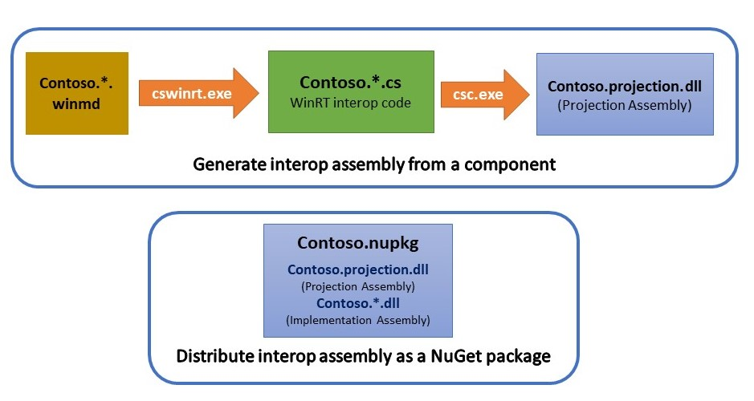
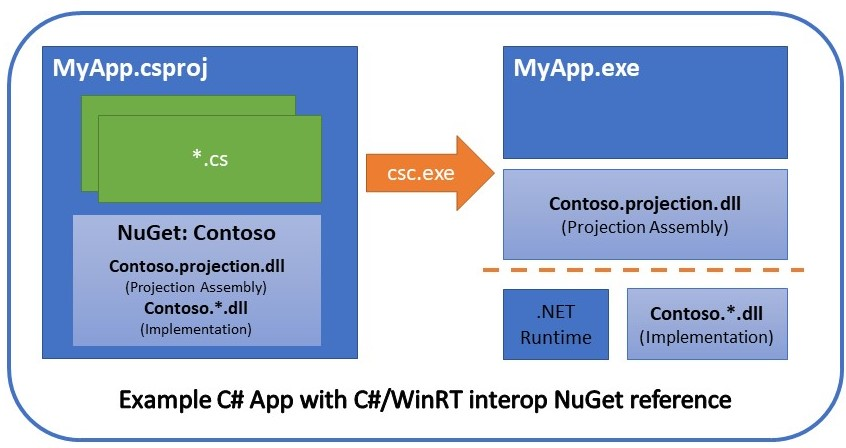

# The C#/WinRT Language Projection

C#/WinRT provides Windows Runtime (WinRT) projection support for the C# language. A "projection" is an adapter that enables programming the WinRT APIs in a natural and familiar way for the target language. The C#/WinRT projection hides the details of interop between C# and WinRT interfaces, and provides mappings of many WinRT types to appropriate .NET equivalents, such as strings, URIs, common value types, and generic collections.  

WinRT APIs are defined in `*.winmd` format, and C#/WinRT includes tooling that generates C# code that can be compiled into interop assemblies, similar to how [C++/WinRT](https://github.com/Microsoft/cppwinrt) generates headers for the C++ language projection. This means that neither the C# compiler nor the .NET Runtime require built-in knowledge of WinRT any longer.

## C#/WinRT Architecture

### Component Authors

Component Authors need to build a C#/WinRT projection for .NET5+ targets.

### Application Developers

.NET5+ apps reference the NuGet package, which pulls in the projection assembly instead of a winmd.

## Motivation

[.NET Core](https://docs.microsoft.com/en-us/dotnet/core/) is the focus for the .NET platform. It is an open-source, cross-platform runtime that can be used to build device, cloud, and IoT applications. Previous versions of .NET Framework and .NET Core have built-in knowledge of WinRT which is a Windows-specific technology. By lifting this projection support out of the compiler and runtime, we are supporting efforts to make .NET more efficient for its .NET 5 release. 

[WinUI3.0](https://github.com/Microsoft/microsoft-ui-xaml) is the effort to lift official native Microsoft UI controls and features out of the operating system, so app developers can use the latest controls and visuals on any in-market version of the OS. C#/WinRT is needed to support the changes required for lifting the XAML APIs out of Windows.UI.XAML and into Microsoft.UI.XAML.

However, C#/WinRT is a general effort and is intended to support other scenarios and versions of the .NET runtime, compatible down to .NET Standard 2.0.

## Installing and running C#/WinRT

Download the C#/WinRT NuGet package here: https://www.nuget.org/packages/Microsoft.Windows.CsWinRT/

C#/WinRT currently requires the following packages, or newer, to build:

- [Visual Studio 16.8](https://visualstudio.microsoft.com/downloads/) 
- [.NET 5.0 SDK](https://dotnet.microsoft.com/download/dotnet/5.0) 
- [.NET Core 2.1 SDK](https://dotnet.microsoft.com/download/dotnet-core/2.1)
- [nuget.exe 5.8.0-preview.3](https://www.nuget.org/downloads)
- WinUI 3 3.0.0-preview1.200515.3

The `build.cmd` script takes care of all related configuration steps and is the simplest way to get started building C#/WinRT. It installs prerequisites such as nuget and the .NET 5 SDK, configures the environment to use .NET 5 (creating a `global.json` if necessary), builds the compiler, and builds and executes the unit tests. To build C#/WinRT, follow these steps: 

- Open a Visual Studio Developer command prompt pointing at the repo.
- Run `build.cmd`. 
- To launch the project in Visual Studio, run `devenv cswinrt.sln` from the same command prompt. This will inherit the necessary environment.

**Note:**  By default, projection projects only generate source files for Release configurations, where cswinrt.exe can execute in seconds.  To generate projection sources for Debug configurations, set the project property GenerateTestProjection to 'true'.  In either case, existing projection sources under the "Generated Files" folder will still be compiled into the projection assembly.  This configuration permits a faster inner loop in Visual Studio.

## What's New

[CsWinRT v1.0](https://github.com/microsoft/CsWinRT/releases/tag/1.0.1.201020.1) is our latest public release, and is compatible with the .NET 5 RTM SDK. We may have preview releases to address specific bug fixes before v1.1. Details on breaking changes and known issues can be found on the [release notes page](https://github.com/microsoft/CsWinRT/releases).

## Developer Guidance

Please read the [usage](docs/usage.md) and [repository structure](docs/structure.md) docs for a detailed breakdown. For recommendations on migrating from System.Runtime.InteropServices, see the [COM Interop](docs/interop.md) guide. For additional documentation visit <http://aka.ms/cswinrt>.

## Related Projects

C#/WinRT is part of the [xlang](https://github.com/microsoft/xlang) family of projects that help developers create APIs that can run on multiple platforms and be used with a variety of languages. The mission of C#/WinRT is not to support cross-platform execution directly, but to support the cross-platform goals of .NET Core. 

C#/WinRT is also part of [Project Reunion](https://github.com/microsoft/ProjectReunion) - a set of libraries, frameworks, components, and tools that you can use in your apps to access powerful platform functionality across many versions of Windows. Project Reunion combines Win32 native app capabilities with modern API usage techniques, so your apps light up everywhere your users are. Project Reunion also includes [WinUI](https://docs.microsoft.com/en-us/windows/apps/winui/), [WebView2](https://docs.microsoft.com/en-us/microsoft-edge/webview2/), [MSIX](https://docs.microsoft.com/en-us/windows/msix/overview), [C++/WinRT](https://github.com/microsoft/CppWinRT/), and [Rust/WinRT](https://github.com/microsoft/winrt-rs).

## Contributing

File a [new issue!](https://github.com/microsoft/CsWinRT/issues/new) This project welcomes contributions and suggestions of all types.

We ask that **before you start work on a feature that you would like to contribute**, please read our [Contributor's Guide](CONTRIBUTING.md). 

### License Info

Most contributions require you to agree to a
Contributor License Agreement (CLA) declaring that you have the right to, and actually do, grant us
the rights to use your contribution. For details, visit https://cla.opensource.microsoft.com.

When you submit a pull request, a CLA bot will automatically determine whether you need to provide a CLA and decorate the PR appropriately (e.g., status check, comment). Simply follow the instructions provided by the bot. You will only need to do this once across all repos using our CLA.

## Code of Conduct

This project has adopted the [Microsoft Open Source Code of Conduct](https://opensource.microsoft.com/codeofconduct/).
For more information see the [Code of Conduct FAQ](https://opensource.microsoft.com/codeofconduct/faq/) or
contact [opencode@microsoft.com](mailto:opencode@microsoft.com) with any additional questions or comments.
