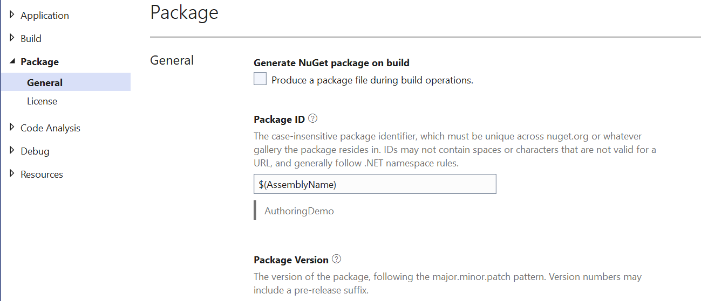

# Authoring C#/WinRT Components

**Note**: C#/WinRT authoring support is in preview. See [Known Issues and Troubleshooting](#known-issues-and-troubleshooting) below for more details on what is supported.

## Overview

C#/WinRT provides support for authoring Windows Runtime components. You can write a library in C#, and specify that it is a `CsWinRTComponent` for C#/WinRT to produce a WinMD that any WinRT compatible language can use. For example, a Windows Runtime component written in C# can be used by a C++ program, via C#/WinRT and C++/WinRT.

## Authoring a C#/WinRT Component

It is recommended to use .NET 6 and Visual Studio 2022 for C#/WinRT authoring scenarios. To author a new component, first create a C# **Class Library** project in Visual Studio. You will need to make the following modifications to the project.

1. In the library project file, update the `TargetFramework` property in order to access Windows Runtime APIs.

      ```xml
      <PropertyGroup>
            <!-- Choose your TargetFramework for the desired Windows SDK version -->
            <TargetFramework>net8.0-windows10.0.19041.0</TargetFramework>
      </PropertyGroup>
      ```

      To access Windows Runtime types, you need to set a specific Windows SDK version in the TFM. See [.NET 5 and later: Use the TFM option](https://docs.microsoft.com/windows/apps/desktop/modernize/desktop-to-uwp-enhance#net-5-and-later-use-the-target-framework-moniker-option) for more details on the supported versions.

2. Install the [Microsoft.Windows.CsWinRT](https://www.nuget.org/packages/Microsoft.Windows.CsWinRT) NuGet package in your project.

3. Add the following C#/WinRT-specific property to the project file. The `CsWinRTComponent` property specifies that your project is a Windows Runtime component, so that a WinMD file is generated when you build the project.

      ```xml
      <PropertyGroup>
            <CsWinRTComponent>true</CsWinRTComponent>
      </PropertyGroup>
      ```

      See [C#/WinRT NuGet properties](../nuget/README.md) for more details on the available C#/WinRT properties.

4. Implement your runtime classes in the class files in your library project, following the necessary [WinRT guidelines and type restrictions](https://docs.microsoft.com/windows/uwp/winrt-components/creating-windows-runtime-components-in-csharp-and-visual-basic#declaring-types-in-windows-runtime-components).

## Packaging your WinRT component

You may want to distribute and share your component as a NuGet package. To generate a NuGet package for the component, you can choose one of the options below. Your component can then be used in consuming apps by a `PackageReference`.

To make your component available as a NuGet package, it is important to include the DLLs necessary for C#/WinRT hosting. When you pack your C#/WinRT component, the hosting DLLs and WinMD are automatically added to your NuGet package, based on a `.nuspec` file.

- Option 1: [Create a package using the dotnet CLI](https://docs.microsoft.com/nuget/create-packages/creating-a-package-dotnet-cli). You can set the package properties in Visual Studio: right-click the project in Solution Explorer, choose **Properties**, and select the **Package** tab. You can also set these properties directly in `.csproj` file.


- Option 2: [Create a package using the nuget.exe CLI](https://docs.microsoft.com/nuget/create-packages/creating-a-package). This involves creating a `.nuspec` file.

  - If authoring your own `.nuspec`, you must include the following `file` entries for your component, `"MyAuthoredComponent"`. Note that the `TargetFramework` may vary. The required files include C#/WinRT targets files which supply the hosting DLLs for app consumers. Any dependencies of your component will need to be specified as well.

      ``` xml
      <files>
      <file src="$(TargetDir)MyAuthoredComponent.dll" 
            target="lib\$(TargetFramework)\MyAuthoredComponent.dll" />
      <file src="$(TargetDir)MyAuthoredComponent.winmd" 
            target="lib\$(TargetFramework)\winmd\MyAuthoredComponent.winmd" /> 
      <file src="$(TargetDir)Microsoft.Windows.SDK.NET.dll"  
            target="lib\$(TargetFramework)\Microsoft.Windows.SDK.NET.dll" />
      
      <!-- Note: you must rename the CsWinRT.Authoring.Targets as follows -->
      <file src="C:\Path\To\CsWinRT\NugetDir\build\Microsoft.Windows.CsWinRT.Authoring.targets"   
            target="buildTransitive\MyAuthoredComponent.targets" />
            
      <!-- buildTransitive is for consumers using PackageReference, build is for consumers using packages.config --> 
      <file src="C:\Path\To\CsWinRT\NugetDir\build\Microsoft.Windows.CsWinRT.Authoring.targets"       
            target="build\MyAuthoredComponent.targets" />
      
      <!-- Include the managed DLLs -->
      <file src="C:\Path\To\CsWinRT\NugetDir\lib\net8.0\WinRT.Host.Shim.dll"                                  
            target="lib\$(TargetFramework)\WinRT.Host.Shim.dll" />  
      <file src="C:\Path\To\CsWinRT\NugetDir\lib\net8.0\WinRT.Runtime.dll"                                  
            target="lib\$(TargetFramework)\WinRT.Runtime.dll" />
      
      <!-- Include the native DLLs -->
      <file src="C:\Path\To\CsWinRT\NugetDir\hosting\x64\native\WinRT.Host.dll"                                  
            target="hosting\x64\native\WinRT.Host.dll" />
      <file src="C:\Path\To\CsWinRT\NugetDir\hosting\x86\native\WinRT.Host.dll"                                  
            target="hosting\x86\native\WinRT.Host.dll" />
      <file src="C:\Path\To\CsWinRT\NugetDir\hosting\arm64\native\WinRT.Host.dll"                                  
            target="hosting\arm64\native\WinRT.Host.dll" />
      
      </files>
      ```

## Consuming C#/WinRT Components

This section describes the steps needed to consume a C#/WinRT component for the following scenarios:

- [C# desktop applications](#consuming-from-c-applications) 
- [C++ desktop applications](#consuming-from-c-applications-1)
- [Windows App SDK applications](#windows-app-sdk-applications)
- [Out of process components](#consuming-an-out-of-process-component)

### Consuming from C# applications

Consuming a C#/WinRT component from C#/.NET apps is supported by both package reference and project reference.
This scenario is equivalent to consuming any ordinary C# class library and does not involve WinRT activation in most cases. 
The exception being in the out-of-process scenario, described below.

**Note:** With C#/WinRT 1.3.5 or later, project references to a C#/WinRT component require .NET 6.

### Consuming from C++ applications

Consuming a C#/WinRT component from a C++/WinRT desktop application is supported by either NuGet package reference or project reference.

- **Package Reference**: In Visual Studio, right-click on the project in Solution Explorer and click **Manage NuGet packages** to search for and install the component package.

- **Project Reference**: In Visual Studio, right-click on the project in Solution Explorer and click **Add** -> **Reference**. Select the C#/WinRT component project under the **Projects** node. 
  - Note: The authoring project cannot target AnyCPU due to limitations between MSBuild and C++ Projects.

  - Note: If your authored component is built with C#/WinRT version 1.3.3 or earlier, you also need a file reference to the `*.winmd` generated in the authored component's output directory. To add a file reference, right-click on the project in Solution Explorer and click **Add** -> **Reference**. Select the file from the **Browse** node. 


#### Manifest Class Registration

Consuming a C#/WinRT component from a C++/WinRT desktop application requires adding manifest class registrations to the application.
The specified activatable Windows Runtime class registrations will direct activation of the component’s classes at runtime. 
There are two different ways to do this depending on if the application is a packaged (with MSIX) or unpackaged C++ app:

  - For **packaged** C++ apps: The app consumer needs to add `ActivatableClass` registration entries to the `Package.appxmanifest` package manifest file like below:

      ``` xml
      <Extensions>
        <Extension Category="windows.activatableClass.inProcessServer">
          <InProcessServer>
            <Path>WinRT.Host.dll</Path>
            <ActivatableClass ActivatableClassId="MyAuthoredComponent.Class1" ThreadingModel="both" />
            <ActivatableClass ActivatableClassId="MyAuthoredComponent.Class2" ThreadingModel="both" />
          </InProcessServer>
         </Extension>
      </Extensions>
      ```

      See the [Simple C#/WinRT component sample](../src/Samples/AuthoringDemo) (specifically the WinUI3CppApp) for an example.

  - For **unpackaged C++ apps**: The app consumer needs to create an [application manifest file](https://docs.microsoft.com/windows/win32/sbscs/application-manifests) (also known as a "fusion manifest") that follows the naming: `<MyNativeAppName>.exe.manifest`. See this [sample manifest file](https://github.com/microsoft/CsWinRT/tree/master/src/Samples/AuthoringDemo/CppConsoleApp/CppConsoleApp.exe.manifest) for an example.

      Follow these steps to add an application manifest file to your project:

      1. In Visual Studio, right click on the project node under **Solution Explorer** and click **Add -> New Item**. Search for the **Text File** template and name your file `<MyNativeAppName>.exe.manifest`.

      2. Add your activatable class registrations to the manifest file. Below is an example with a C#/WinRT component called `MyAuthoredComponent` and activatable classes `WinRTComponent.Class*`. Note that `WinRT.Host.dll` must be specified as the file name, without a relative path.

            ```xml
            <?xml version="1.0" encoding="utf-8"?>
            <assembly manifestVersion="1.0" xmlns="urn:schemas-microsoft-com:asm.v1">
              <assemblyIdentity version="1.0.0.0" name="CppConsoleApp"/>
              <file name="WinRT.Host.dll">
                <activatableClass name="MyAuthoredComponent.Class1"
                                  threadingModel="both"
                                  xmlns="urn:schemas-microsoft-com:winrt.v1" />
                <activatableClass name="MyAuthoredComponent.Class2"
                                  threadingModel="both"
                                  xmlns="urn:schemas-microsoft-com:winrt.v1" />
              </file>
            </assembly>
            ```

      3. Modify the project to include the manifest file in the output when deploying the project. Right-click on the file in **Solution Explorer**, select **Properties**, and set the **Content** property to **True** using the drop-down arrow on the right.

### Windows App SDK Applications

Authoring and consuming WinUI types in Windows App SDK applications is in development and is supported with some exceptions.
Component authors can implement WinUI types using the Windows App SDK C# class library project template. 
Components can be consumed by application projects that reference the Windows App SDK.

#### Support Matrix

The following tables outline the Windows App SDK application types that are supported when consuming C#/WinRT authored components implementing WinUI types:

- ✅ Scenario works
- 🟨 Scenario partially works (i.e. with specific limitations)
- 🟥 Scenario does not work
- Note: "WAP" refers to the usage of a separate Windows Application Packaging Project in packaged apps.

##### C++
|Application Type|Project or Package Reference|Supported?|Tracking issue|
|:--|:-:|:-:|:-:|
|C++ Packaged|Project Reference| ✅ | |
|C++ Packaged with WAP |Project Reference| 🟥 | [#1120](https://github.com/microsoft/CsWinRT/issues/1120) |
|C++ Unpackaged|Project Reference| ✅ | |
|C++ Packaged|Package Reference|🟨 | [#1118](https://github.com/microsoft/CsWinRT/issues/1118) |
|C++ Packaged with WAP |Package Reference| 🟥 | [#1123](https://github.com/microsoft/CsWinRT/issues/1123) |
|C++ Unpackaged|Package Reference|🟨 | [#1118](https://github.com/microsoft/CsWinRT/issues/1118) |

##### C#
|Application Type|Project or Package Reference|Supported?|Tracking issue|
|:--|:-:|:-:|:-:|
|C# Packaged|Project Reference| ✅ |
|C# Packaged with WAP|Project Reference| ✅ |
|C# Unpackaged|Project Reference| ✅ |  |
|C# Packaged|Package Reference| 🟨 | [#1118](https://github.com/microsoft/CsWinRT/issues/1118) |
|C# Packaged with WAP |Package Reference| 🟨 | [#1118](https://github.com/microsoft/CsWinRT/issues/1118) |
|C# Unpackaged|Package Reference|🟥 | [#1116](https://github.com/microsoft/CsWinRT/issues/1116) |

#### Authoring a C# component with Windows App SDK

In addition to the instructions outlined above in [Authoring a C#/WinRT Component](#authoring-a-cwinrt-component), you will also need to add the following property to your C# library project file:

```xml
<PropertyGroup>
      <!-- Needed for enabling project references to C# libraries from C++ applications -->
      <WindowsAppContainer>true</WindowsAppContainer> 
<PropertyGroup>
```

#### Consumption of WinUI controls from C++ apps

If a C++ app is consuming a component that provides a custom user control, there are a few extra configuration steps:
Note that "MyAuthoredComponent" should be renamed to your component; "MyAuthoredComponent" is just an example.

1. In the app's `pch.h` header file, add the following line:

      ```cpp
      #include <winrt/MyAuthoredComponent.MyAuthoredComponent_XamlTypeInfo.h>
      ```

2.  In the manifest file, add an additional `ActivatableClass` entry for `MyAuthoredComponent.MyAuthoredComponent_XamlTypeInfo.XamlMetaDataProvider`, in addition to the manifest entries for the classes being consumed.

      i. For **unpackaged** apps: add an entry similar to the following to `AppName.exe.manifest`:

      ```xml
      <activatableClass
            name="MyAuthoredComponent.MyAuthoredComponent_XamlTypeInfo.XamlMetaDataProvider"
            threadingModel="both"
            xmlns="urn:schemas-microsoft-com:winrt.v1" />
      ```
      ii. For **packaged** apps, add an entry similar to the following to `Package.appxmanifest`:

      ```xml
      <ActivatableClass ActivatableClassId="MyAuthoredComponent.MyAuthoredComponent_XamlTypeInfo.XamlMetaDataProvider" ThreadingModel="both" />
      ```

      You will need to right-click on the file and select **Open With** -> **XML (Text Editor)** in order to edit the file.
      You may need to add the appxmanifest to the solution view; to do this right-click the project and select **Add exisiting item** to select `Package.appxmanifest`.

### Consuming an out of process component

C#/WinRT supports authoring out-of-process components that can be consumed by Windows Runtime compatible languages. Currently, consuming an out-of-process component is supported for managed C# apps with the use of a packaging project. This scenario requires creating a `WinRT.Host.runtimeconfig.json` file, as demonstrated in the [background task component sample](https://github.com/microsoft/CsWinRT/tree/master/src/Samples/BgTaskComponent). Native C++ consumption of out-of-process C# components is not fully supported yet.

## Known Issues and Troubleshooting

- Project reference support (from C++ and C# apps) for C#/WinRT authored components is available with .NET 6. Referencing a C#/WinRT authored component by project reference in a C# app is **not supported with .NET 5**.

- Authoring issues are [tagged under the *authoring* label](https://github.com/microsoft/CsWinRT/issues?q=is%3Aopen+is%3Aissue+label%3Aauthoring). Feel free to [file an issue](https://github.com/microsoft/CsWinRT/issues/new/choose) tagged with the *authoring* label if you encounter any new issues!

- The docs [here](https://docs.microsoft.com/windows/uwp/cpp-and-winrt-apis/troubleshooting#symptoms-and-remedies) have useful troubleshooting tips for working with C++/WinRT.

- When adding an `exe.manifest`, if you get an error in the linker (LNK) typically this is due to multiple manifests being found, 
  and `app.manifest` can be removed to resolve the issue.


## Resources

Here are some resources that demonstrate authoring C#/WinRT components and the details discussed in this document.

1. [Simple C#/WinRT component sample](https://github.com/microsoft/CsWinRT/tree/master/src/Samples/AuthoringDemo) and associated [walkthrough on creating a C#/WinRT component and consuming it from C++/WinRT](https://docs.microsoft.com/windows/uwp/csharp-winrt/create-windows-runtime-component-cswinrt) 

2. [Background Task component sample](https://github.com/microsoft/CsWinRT/tree/master/src/Samples/BgTaskComponent) demonstrating consuming an out-of-process C#/WinRT component from a packaged .NET WPF app

3. Testing projects used for authoring:
      - [Test Component](https://github.com/microsoft/CsWinRT/tree/master/src/Tests/AuthoringTest)
      - [Test Application](https://github.com/microsoft/CsWinRT/tree/master/src/Tests/AuthoringConsumptionTest)

4. [Managed component hosting](https://github.com/microsoft/CsWinRT/blob/master/docs/hosting.md) 

5. [Diagnose component errors](https://docs.microsoft.com/windows/uwp/csharp-winrt/authoring-diagnostics)
