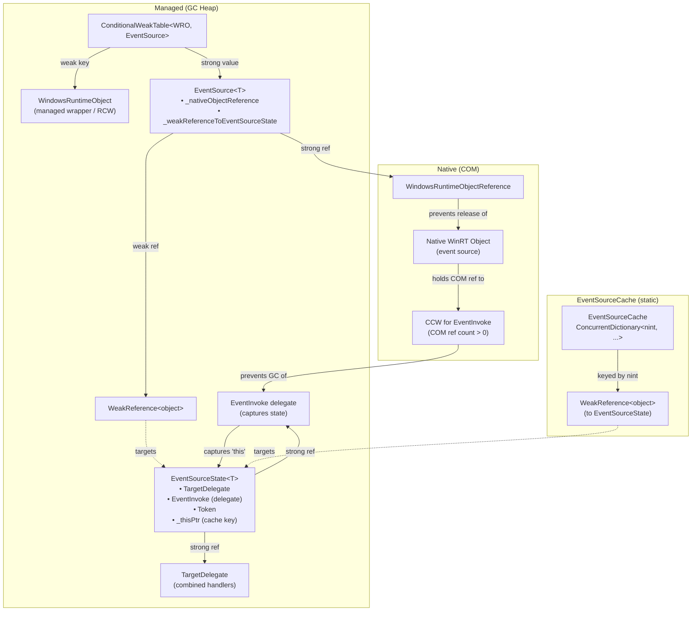
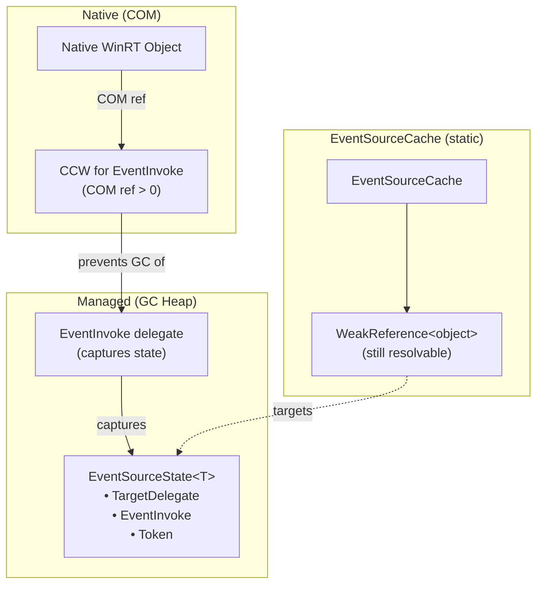
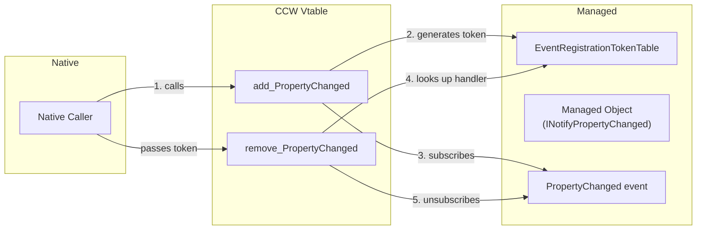
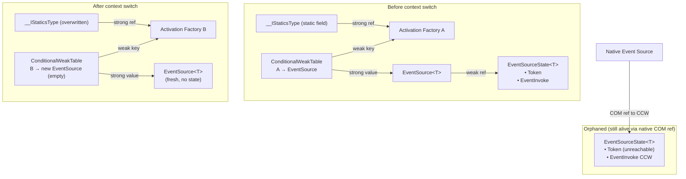

# Windows Runtime Event Infrastructure

This document provides a deep dive into how CsWinRT's event infrastructure works in `WinRT.Runtime2`. It covers event sources, event states, the event source cache, event registration tokens, RCW/CCW interaction, lifetime management across the native ABI boundary, and the specific behavior of static events.

## Table of Contents

- [Overview](#overview)
- [Core Types](#core-types)
  - [EventRegistrationToken](#eventregistrationtoken)
  - [EventSource\<T\>](#eventsourcet)
  - [EventSourceState\<T\>](#eventsourcestatet)
  - [EventSourceCache](#eventsourcecache)
  - [EventRegistrationTokenTable\<T\>](#eventregistrationtokentablet)
- [Instance Events (RCW → Native)](#instance-events-rcw--native)
  - [Subscribe Flow](#subscribe-flow)
  - [Unsubscribe Flow](#unsubscribe-flow)
  - [Object Diagrams](#object-diagrams)
- [CCW Events (Native → Managed)](#ccw-events-native--managed)
- [Lifetime and GC](#lifetime-and-gc)
  - [What Keeps What Alive](#what-keeps-what-alive)
  - [EventInvoke Delegate and the CCW](#eventinvoke-delegate-and-the-ccw)
  - [Reference Tracking Integration](#reference-tracking-integration)
  - [Cleanup on GC](#cleanup-on-gc)
- [Static Events](#static-events)
  - [How Static Events Differ from Instance Events](#how-static-events-differ-from-instance-events)
  - [The Activation Factory Cache](#the-activation-factory-cache)
  - [Context Switches and the IsInCurrentContext Check](#context-switches-and-the-isincurrentcontext-check)
  - [Static Event Lifecycle Analysis](#static-event-lifecycle-analysis)

---

## Overview

Windows Runtime events follow a pattern where subscribing to an event yields an `EventRegistrationToken`, and that same token must be passed back to unsubscribe. CsWinRT bridges this model to the .NET `event += handler` / `event -= handler` pattern, maintaining a parallel set of infrastructure that:

1. **Wraps native COM event subscriptions** (for managed code consuming native events — the RCW path).
2. **Exposes managed events to native callers** (for native code consuming managed events — the CCW path).

These two paths use different core types:

| Path | Direction | Core Types |
|------|-----------|-----------|
| **RCW events** | Managed subscribes to a native event | `EventSource<T>`, `EventSourceState<T>`, `EventSourceCache` |
| **CCW events** | Native subscribes to a managed event | `EventRegistrationTokenTable<T>` |

---

## Core Types

### EventRegistrationToken

**File:** `InteropServices/Events/EventRegistrationToken.cs`

A simple value type wrapping a 64-bit integer. This is the Windows Runtime's concept of a "subscription handle" — you get one from `add_EventName` and pass it to `remove_EventName` to unsubscribe.

```csharp
public struct EventRegistrationToken : IEquatable<EventRegistrationToken>
{
    public long Value { get; set; }
}
```

### EventSource\<T\>

**File:** `InteropServices/Events/EventSource{T}.cs`

The main entry point for managed code subscribing to a native Windows Runtime event. Each `EventSource<T>` wraps a specific event on a specific native object. It:

- Holds a strong reference to the `WindowsRuntimeObjectReference` for the native object.
- Maintains a `WeakReference<object>` pointing to an `EventSourceState<T>` (which holds the actual registration state).
- Coordinates `Subscribe` / `Unsubscribe` operations, including marshalling calls to the native vtable.
- Uses a vtable **index** to find `add_EventName` and `remove_EventName` — these are always at consecutive vtable slots (`[Index]` and `[Index + 1]`).

**Key design choice:** The `EventSource<T>` itself doesn't directly hold the `EventRegistrationToken` or the combined delegate. Those live in the `EventSourceState<T>`, which is kept alive by the native side through a CCW. This separation ensures event registrations survive garbage collection of the `EventSource<T>` object.

Concrete derived types exist for each delegate shape:

| Type | Delegate Type |
|------|--------------|
| `EventHandlerEventSource` | `EventHandler` |
| `EventHandlerEventSource<TEventArgs>` | `EventHandler<TEventArgs>` |
| `EventHandlerEventSource<TSender, TEventArgs>` | `EventHandler<TSender, TEventArgs>` |
| `PropertyChangedEventHandlerEventSource` | `PropertyChangedEventHandler` |
| `NotifyCollectionChangedEventHandlerEventSource` | `NotifyCollectionChangedEventHandler` |
| `VectorChangedEventHandlerEventSource<T>` | `VectorChangedEventHandler<T>` |
| `MapChangedEventHandlerEventSource<K, V>` | `MapChangedEventHandler<K, V>` |

Each derived type implements two abstract methods:
- `ConvertToUnmanaged(T handler)` — marshals the delegate to a native CCW.
- `CreateEventSourceState()` — creates the concrete `EventSourceState<T>` subclass.

### EventSourceState\<T\>

**File:** `InteropServices/Events/EventSourceState{T}.cs`

Holds all the mutable state for a single native event registration:

| Field | Purpose |
|-------|---------|
| `void* _thisPtr` | The native pointer for the event source object (used only as a cache key — never dereferenced). |
| `int _index` | The event's vtable index. |
| `WeakReference<object> _weakReferenceToSelf` | Used in `EventSourceCache` to allow weak tracking of this state object. |
| `void* _eventInvokePtr` | Pointer to the CCW for the `EventInvoke` delegate. |
| `void* _referenceTrackerTargetPtr` | IReferenceTrackerTarget on the CCW (for XAML reference tracking). |
| `T? TargetDelegate` | The combined multicast delegate of all managed handlers currently subscribed. |
| `T EventInvoke` | The delegate instance registered with the native event. This captures `this` (the state). |
| `EventRegistrationToken Token` | The token returned from the native `add_EventName` call. |

The `EventInvoke` delegate is the central piece of the design. It is a delegate that:
1. Captures `this` (the `EventSourceState<T>` instance), keeping the state alive.
2. When invoked, calls `TargetDelegate?.Invoke(...)` to forward to all managed subscribers.
3. Is marshalled into a CCW and passed to the native `add_EventName` call.

Each concrete state creates its `EventInvoke` via `GetEventInvoke()`:

```csharp
protected override EventHandler<TSender, TEventArgs> GetEventInvoke()
{
    // Captures 'this', keeping the state alive as long as the native side
    // holds a reference to the CCW for this delegate.
    return (obj, e) => TargetDelegate?.Invoke(obj, e);
}
```

### EventSourceCache

**File:** `InteropServices/Events/EventSourceCache.cs`

A global, static cache that allows event registrations to survive garbage collection of `EventSource<T>` objects. Without this, if managed code let go of an `EventSource<T>` and then tried to resubscribe, it would lose knowledge of the existing native registration.

**Structure:**

```
Global:   ConcurrentDictionary<nint, EventSourceCache>    (keyed by native this pointer)
Per-obj:  ConcurrentDictionary<int, WeakReference<object>> (keyed by event vtable index)
```

Each `EventSourceCache` instance also holds an `IWeakReference` to the native COM object, used to detect when the native object has been destroyed. If the weak reference can no longer be resolved, the cache entry is cleared.

**When is the cache used?**

- **On `Subscribe`**: After creating a new `EventSourceState<T>`, `EventSourceCache.Create(...)` is called to store a weak reference to the state. This only works if the native object supports `IWeakReferenceSource`.
- **On `EventSource<T>` construction**: The constructor calls `EventSourceCache.GetState(...)` to check if there's an existing state for this object+event. If so, it reconnects to it.
- **On `EventSourceState<T>` disposal/finalization**: `EventSourceCache.Remove(...)` is called to clean up.

### EventRegistrationTokenTable\<T\>

**File:** `InteropServices/Events/EventRegistrationTokenTable{T}.cs`

Used exclusively for the **CCW path** (native code subscribing to managed events). This table maps `EventRegistrationToken` values to delegate instances.

**Token structure:**

```
┌─────────────────────────────────┬─────────────────────────────────┐
│     Upper 32 bits               │     Lower 32 bits               │
│     typeof(T).GetHashCode()     │     Incrementing counter        │
└─────────────────────────────────┴─────────────────────────────────┘
```

The upper 32 bits encode the delegate type's hash, which serves as a validation check during `RemoveEventHandler` to reject tokens from a mismatched event type. The lower 32 bits are an incrementing counter (starting from a random value) that serves as the actual lookup key into an internal dictionary.

---

## Instance Events (RCW → Native)

This section describes the typical flow when managed code subscribes to/unsubscribes from an event on a native Windows Runtime object.

### Subscribe Flow

```
Managed code:   myObject.SomeEvent += myHandler;
```

This compiles down to a call through the projected interface implementation, which calls into the ABI methods layer and ultimately into `EventSource<T>.Subscribe(handler)`. Here's what happens step by step:

1. **Get or create the `EventSource<T>`** — A `ConditionalWeakTable<WindowsRuntimeObject, EventSourceT>` keyed on the managed wrapper object is used to ensure there's at most one `EventSource<T>` per event per object.

2. **Check for existing state** — Inside `Subscribe`, under a lock, the method checks if there's already a live `EventSourceState<T>` (via the weak reference) that still has COM references.

3. **Create new state if needed** — If there's no live state, a new `EventSourceState<T>` is created. Its constructor calls `GetEventInvoke()` to produce the `EventInvoke` delegate (which captures `this`).

4. **Register in cache** — `EventSourceCache.Create(...)` is called, which stores a weak reference to the state in the global cache (only if the native object supports `IWeakReferenceSource`).

5. **Add the handler** — `state.AddHandler(handler)` combines the new handler into `TargetDelegate` via `Delegate.Combine`.

6. **Marshal and call native** — The `EventInvoke` delegate is marshalled to a CCW, reference tracking is initialized, and the native `add_EventName` vtable call is made. The returned `EventRegistrationToken` is stored in the state.

### Unsubscribe Flow

```
Managed code:   myObject.SomeEvent -= myHandler;
```

1. **Check for live state** — If the weak reference to the state is dead, there's nothing to do (early return).

2. **Remove handler** — `state.RemoveHandler(handler)` calls `Delegate.Remove` on `TargetDelegate`.

3. **If last handler removed** — When the `TargetDelegate` transitions from non-null to null, the native `remove_EventName` call is made using the stored `EventRegistrationToken`. The state is then disposed, clearing the cache entry.

### Object Diagrams

#### During Active Subscription



**Who keeps what alive:**

| Object | Kept alive by |
|--------|--------------|
| `WindowsRuntimeObject` (RCW) | Application code holding a reference to the projected object |
| `EventSource<T>` | `ConditionalWeakTable` entry (alive while the RCW is alive) |
| `EventSourceState<T>` | The `EventInvoke` delegate captures it; the CCW of that delegate is held by the native event source |
| `EventInvoke` delegate (CCW) | The native Windows Runtime object holds a COM reference to it |
| `WindowsRuntimeObjectReference` | `EventSource<T>._nativeObjectReference` holds a strong reference |
| `TargetDelegate` (combined handlers) | `EventSourceState<T>.TargetDelegate` holds a strong reference |

> **Key insight:** Even if the `EventSource<T>` is garbage collected (e.g., the RCW is collected), the `EventSourceState<T>` survives because the native object holds a COM reference to the CCW wrapping `EventInvoke`, which captures the state. The `EventSourceCache` can then reconnect a new `EventSource<T>` to the surviving state.

#### After RCW is GC'd (subscription still active on native side)



When someone later creates a new `EventSource<T>` for the same object+event, it will find the surviving state through `EventSourceCache.GetState(...)` and reconnect.

---

## CCW Events (Native → Managed)

When a managed object is exposed to native code (the CCW path), and native code subscribes to a managed event, a completely different mechanism is used.

For each interface that has events, the `Impl` class (e.g., `INotifyPropertyChangedImpl`) maintains a `ConditionalWeakTable<TInterface, EventRegistrationTokenTable<TDelegate>>` keyed on the managed object instance:

```csharp
// In INotifyPropertyChangedImpl
private static ConditionalWeakTable<INotifyPropertyChanged,
    EventRegistrationTokenTable<PropertyChangedEventHandler>> PropertyChangedTable;
```

**add_EventName (native → managed):**

1. Get the managed object from the CCW dispatch pointer.
2. Marshal the native delegate handler to a managed delegate.
3. Generate a token and store the handler in the token table.
4. Subscribe the managed handler to the actual .NET event.

**remove_EventName (native → managed):**

1. Get the managed object from the CCW dispatch pointer.
2. Look up the handler by token in the token table.
3. Remove the handler from the .NET event.



---

## Lifetime and GC

### What Keeps What Alive

The event infrastructure uses a carefully designed chain of strong and weak references to ensure:

1. **Active subscriptions are not prematurely collected**, even if the managed `EventSource<T>` wrapper is GC'd.
2. **No preventing GC of the managed RCW** — the `ConditionalWeakTable` uses the RCW as a weak key, so the event source doesn't keep the RCW alive.
3. **No preventing GC of native objects** — once all managed handlers are removed, the CCW reference is released and the native object can be destroyed.

### EventInvoke Delegate and the CCW

The `EventInvoke` delegate is the linchpin of the design:

```
Native event source
       │
       │ holds COM reference to
       ▼
  CCW (EventInvoke delegate)
       │
       │ prevents GC of delegate, which captures
       ▼
  EventSourceState<T>
       │
       │ holds TargetDelegate, Token, etc.
```

Because the lambda passed from `GetEventInvoke()` captures `this` (the `EventSourceState<T>`), the delegate instance's `Target` property points to the state. The CCW wrapping this delegate prevents the GC from collecting both the delegate and the state, as long as the native object holds its COM reference.

### Reference Tracking Integration

In XAML scenarios, the native framework uses `IReferenceTracker` / `IReferenceTrackerTarget` to manage lifetimes outside of normal COM reference counting. The `EventSourceState<T>` integrates with this:

1. After registering the `EventInvoke` CCW with the native object, `InitializeReferenceTracking(...)` queries for `IReferenceTrackerTarget` on the CCW.
2. `HasComReferences()` checks **both** the COM reference count **and** the reference tracker count to determine if the native side still holds a reference.
3. If `HasComReferences()` returns `false`, the next `Subscribe` call knows it must create a fresh state and re-register.

### Cleanup on GC

When an `EventSourceState<T>` is finalized (because the native object released its CCW reference and nothing else references the state):

1. The finalizer calls `OnDispose()`.
2. `OnDispose()` calls `EventSourceCache.Remove(...)` to clean up the cache entry.
3. If this was the last state in the cache for that native object, the `EventSourceCache` entry itself is removed from the global dictionary.

Explicit disposal (via `Unsubscribe`) follows the same path but also calls `GC.SuppressFinalize` to avoid double cleanup.

---

## Static Events

### How Static Events Differ from Instance Events

For instance events, the `ConditionalWeakTable` is keyed on the managed wrapper object (`WindowsRuntimeObject`):

```csharp
// Instance events (in the generated ABI methods class)
ConditionalWeakTable<WindowsRuntimeObject, EventHandlerEventSource> table;

public static EventHandlerEventSource SomeEvent(
    WindowsRuntimeObject thisObject,             // <-- the managed RCW
    WindowsRuntimeObjectReference thisReference)
{
    return table.GetOrAdd(
        key: thisObject,
        valueFactory: (_, ref) => new EventHandlerEventSource(ref, vtableIndex),
        factoryArgument: thisReference);
}
```

For **static events**, there's no object instance. Instead, the generated code uses a **globally cached activation factory object reference** as the key:

```csharp
// Generated in the projected class
private static WindowsRuntimeObjectReference __IStaticsType
{
    get
    {
        var ___IStaticsType = field;
        if (___IStaticsType != null && ___IStaticsType.IsInCurrentContext)
        {
            return ___IStaticsType;
        }
        return field = WindowsRuntimeActivationFactory.GetActivationFactory("TypeName", iid);
    }
}
```

And the event accessors pass this factory reference as the `thisObject`:

```csharp
// Generated static event
public static event EventHandler SomeStaticEvent
{
    add => ABI.IStaticsTypeMethods.SomeStaticEvent(__IStaticsType, __IStaticsType).Subscribe(value);
    //                                             ^^^^^^^^^^^^^^^^  ^^^^^^^^^^^^^^^
    //                                             thisObject (key)  thisReference
    remove => ABI.IStaticsTypeMethods.SomeStaticEvent(__IStaticsType, __IStaticsType).Unsubscribe(value);
}
```

In the ABI methods class, the `ConditionalWeakTable` is keyed on `object` (not `WindowsRuntimeObject`):

```csharp
// Generated in ABI static methods class
ConditionalWeakTable<object, EventHandlerEventSource> _SomeStaticEvent;

public static EventHandlerEventSource SomeStaticEvent(
    object thisObject,                            // <-- the activation factory obj ref
    WindowsRuntimeObjectReference thisReference)
{
    return _SomeStaticEvent.GetOrAdd(
        key: thisObject,
        valueFactory: (_, ref) => new EventHandlerEventSource(ref, vtableIndex),
        factoryArgument: thisReference);
}
```

### The Activation Factory Cache

The static property `__IStaticsType` uses a **semi-cached** pattern:

1. On first access: calls `WindowsRuntimeActivationFactory.GetActivationFactory(...)` and stores the result.
2. On subsequent accesses: checks `IsInCurrentContext`. If the current COM context matches the one where the factory was created, returns the cached value.
3. If the context has changed (e.g., thread apartment transition): **re-fetches** the activation factory and **overwrites** the cached field.

This means the cached `WindowsRuntimeObjectReference` for the activation factory can be replaced at any time if there's a context switch.

### Context Switches and the IsInCurrentContext Check

The `IsInCurrentContext` property (from `ContextAwareObjectReference`) compares the current COM context token to the one captured when the object reference was created:

```csharp
private protected sealed override bool DerivedIsInCurrentContext()
{
    return _contextToken == 0 || _contextToken == WindowsRuntimeImports.CoGetContextToken();
}
```

When this returns `false`, the generated code discards the cached activation factory and creates a fresh one. This is where the concern about static events arises.

### Static Event Lifecycle Analysis

Let's trace through a scenario to understand the lifetime implications:

#### Scenario: Subscribe, context switch, then unsubscribe

**Step 1: Managed code subscribes to a static event.**

```csharp
MyRuntimeClass.StaticEvent += MyHandler;
```

- `__IStaticsType` is fetched (activation factory object reference `A`).
- `A` is used as the key in `ConditionalWeakTable<object, EventSource>`.
- An `EventSource<T>` is created and cached in the table against `A`.
- `EventSource<T>.Subscribe(handler)` creates an `EventSourceState<T>`, registers with native, gets a token.
- `EventSourceCache.Create(A, index, state)` is called. **But**: most static/factory classes **do not implement `IWeakReferenceSource`**. In that case, `EventSourceCache.Create` returns early without caching anything. This is documented in the code:

  > _"Note that most static/factory classes do not implement `IWeakReferenceSource`, so a static codegen caching approach is also used."_

- The `EventSource<T>` (and indirectly the `EventSourceState<T>`) is kept alive through the `ConditionalWeakTable` entry keyed on `A`.

**Step 2: A context switch occurs.**

- Code on a different thread (different COM apartment) accesses `__IStaticsType`.
- `IsInCurrentContext` returns `false` for `A`.
- A new activation factory `B` is fetched and stored in `field`, **replacing** `A`.

**Step 3: What happens to `A`?**

- `A` is no longer referenced by the static `field` (it was overwritten by `B`).
- The `ConditionalWeakTable` used `A` as a **weak key**. Once `A` has no strong references, it becomes eligible for GC.
- When `A` is collected, the `ConditionalWeakTable` automatically removes the entry, which means the `EventSource<T>` is also eligible for GC.
- The `EventSource<T>` held a `WeakReference<object>` to the `EventSourceState<T>`.

**But** — the `EventSourceState<T>` is **still alive**, because:
- The native event source holds a COM reference to the CCW of the `EventInvoke` delegate.
- The `EventInvoke` delegate captures the `EventSourceState<T>`.
- The state holds the `EventRegistrationToken` and the `TargetDelegate`.

So the subscription itself is still active on the native side. The managed handler will still be called when the event fires.

**Step 4: Managed code tries to unsubscribe.**

```csharp
MyRuntimeClass.StaticEvent -= MyHandler;
```

- `__IStaticsType` now returns `B` (the new activation factory).
- `B` is used as the key in the `ConditionalWeakTable`.
- The table lookup for `B` finds **no entry** (the old entry was keyed on `A`, which is gone).
- A **new** `EventSource<T>` is created for `B`.
- `EventSource<T>.Unsubscribe(handler)` is called. The new event source has a `null` `_weakReferenceToEventSourceState`, since it was just created and `EventSourceCache.GetState(B, index)` returns `null` (no state was ever registered for `B`, and even if a cache had existed for the old pointer, static factories typically don't support `IWeakReferenceSource`).
- **The unsubscribe does nothing.** The early return path is hit:

  ```csharp
  if (_weakReferenceToEventSourceState is null || !TryGetStateUnsafe(out EventSourceState<T>? state))
  {
      return;  // <-- we end up here
  }
  ```

**Result:** The managed handler remains subscribed on the native side. The `EventSourceState<T>` (with the token and CCW) is orphaned — still alive (held by native), but unreachable from managed code. The native event will continue to invoke the handler, and there's no way for managed code to unsubscribe.

#### Summary of the Static Event Problem



This is a potential issue because:

1. **The handler cannot be unsubscribed** — the token is trapped in the orphaned `EventSourceState<T>`.
2. **The handler continues to fire** — the native side still invokes the CCW, which forwards to `TargetDelegate`.
3. **The `EventSourceCache` doesn't help** — static factories typically don't implement `IWeakReferenceSource`, so no cache entry was ever created.

Note that in practice, this scenario is relatively rare: it requires a static event subscription followed by a COM apartment context switch that causes the activation factory to be re-fetched, followed by an attempt to unsubscribe. Most Windows Runtime applications run UI code on a single STA thread, and static events are uncommon. However, the theoretical possibility exists and should be understood by anyone working on or debugging the event infrastructure.

#### Why the Root Cause Matters

The fundamental issue is that the activation factory object reference is an **unstable key**: it can be replaced whenever a context switch occurs. Any caching strategy that is layered on top of this unstable identity — whether it's a `ConditionalWeakTable`, a static field, or anything else — will lose track of the old `EventSourceState<T>` (and its token) when the key changes.

For example, one might consider using a **static (codegen-level) event source field** (similar to how `WindowsRuntimeObservableVector<T>` stores its event source in a per-instance field). But this has the same problem: the static field would be populated on first access with an `EventSource<T>` wrapping the activation factory from that context. After a context switch, that event source would wrap a stale object reference for a different context, making native vtable calls through it invalid. Adding the same `IsInCurrentContext` invalidation pattern to the field would bring us right back to the original problem — replacing the event source loses the state.

#### Why Alternative Cache Key Strategies Don't Help

One might consider using a **stable, context-independent key** (e.g., a singleton per type or a type handle) instead of the activation factory object reference. This would prevent the `ConditionalWeakTable` entry from being lost on context switches. However, it introduces a different problem: the `EventSource<T>` cached against that stable key permanently wraps the `WindowsRuntimeObjectReference` from the original context. After a context switch, `Subscribe`/`Unsubscribe` on that event source would call into the native vtable through a stale, wrong-context object reference.

Similarly, a **static (codegen-level) event source field** (similar to how `WindowsRuntimeObservableVector<T>` stores its event source in a per-instance field) would be populated on first access with an `EventSource<T>` wrapping the activation factory from that context. After a context switch, that event source would wrap a stale object reference for a different context. Adding the same `IsInCurrentContext` invalidation pattern to the field would bring us right back to the original problem — replacing the event source loses the state.

In short: **changing the key alone doesn't work** because the `EventSource<T>` binds to a specific `WindowsRuntimeObjectReference` at construction time, and that reference is tied to a particular COM context. You'd need to also invalidate and recreate the event source when the context changes, which loses the old `EventSourceState<T>` — exactly the problem we're trying to solve.

#### How This Could be Resolved

The root cause is that the activation factory object reference is an **unstable key** that can be replaced on context switches, yet it's also the key that keeps the `EventSource<T>` (and indirectly the `EventSourceState<T>` with its token) reachable. The fix must ensure the old activation factory (and therefore the old event source / state) remains reachable while subscriptions are active. This is safe because `EventSource<T>` already handles cross-context calls correctly — `WindowsRuntimeObjectReference.AsValue()` / `GetThisPtrWithContextUnsafe()` will marshal to the correct context via COM context callbacks when needed.

**Keep a strong reference to the activation factory while subscriptions are active** — The `EventSourceState<T>` (or the `EventSource<T>`) could hold a strong reference back to the activation factory object reference that was used during subscription. Because `ConditionalWeakTable` uses weak keys, keeping a strong reference to the old activation factory prevents it from being collected, which in turn prevents the table entry (and the `EventSource<T>`) from being evicted. When the activation factory property is later accessed from a different context, it will produce a new `WindowsRuntimeObjectReference` and cache it in `field`, but the old one remains alive (held by the state). The `ConditionalWeakTable` lookup from the new context won't find a match (different key identity), but the **`EventSourceCache`** (keyed by native pointer, not object identity) can reconnect a new `EventSource<T>` to the surviving `EventSourceState<T>` — provided the native object supports `IWeakReferenceSource`. If it doesn't (which is the common case for static factories), an additional mechanism would be needed — for instance, having the generated code also maintain a direct strong reference to the `EventSource<T>` in a static field while subscriptions are active, bypassing the `ConditionalWeakTable` for the reconnection step.

This approach is the most targeted fix: it only keeps the factory alive for the duration of active subscriptions, the existing `EventSource<T>` correctly handles cross-context marshalling for any native calls, and it naturally cleans up when all handlers are removed (the strong reference is released, the activation factory becomes collectible, and the `ConditionalWeakTable` entry is evicted).
