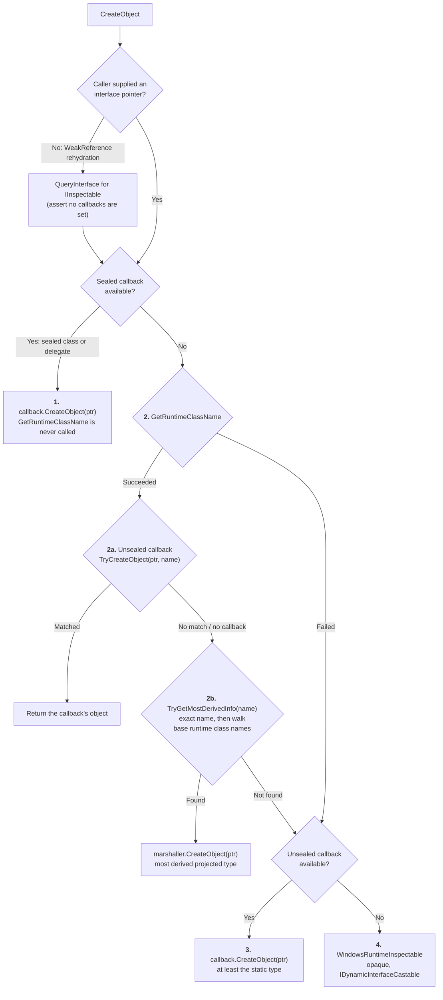

# RCW marshalling

## Overview

This document explains how CsWinRT 3.0 creates **RCWs** (Runtime Callable Wrappers), i.e. the managed objects that wrap native Windows Runtime objects when they cross the ABI boundary from native to managed.

All of this logic lives in [`WindowsRuntimeComWrappers.CreateObject`](../src/WinRT.Runtime2/InteropServices/WindowsRuntimeComWrappers.cs), the `ComWrappers` override that the runtime invokes whenever a new wrapper needs to be created for a native object.

The important thing to understand up front is that RCW creation is primarily a **specialization** problem. Almost every path through `CreateObject` produces a usable object, and the decision ladder exists for one reason: to return the **most derived, most statically-typed** managed object we can justify, so that callers get real metadata-level interface implementations (fast interface dispatch) instead of falling back to dynamic interface casts.

There is one important exception to "specialization only", covered in detail [below](#resilience-to-missing-or-incorrect-runtime-class-names): a runtime class name that we *recognise* is trusted, so a native object reporting a **wrong but known** name can produce a failure or an unexpected type. Names that are missing or unrecognised, by contrast, are never silently trusted — they cost you specialization, not correctness.

Note also that not every result is a wrapper object. Delegates marshal to managed `Delegate` instances, and custom-mapped types marshal to their .NET counterparts without wrapping at all (e.g. `Windows.Foundation.Uri` produces a `System.Uri`, reported with `CreatedWrapperFlags.NonWrapping`). Only the class and interface wrapper paths necessarily produce `WindowsRuntimeObject` instances.

A secondary constraint shapes the design: everything must be **trimming and Native AOT friendly**. That is why the specialization hooks are `static abstract` interface callbacks resolved through generics rather than reflection: ILC can see through them, fold them, and trim the ones that are never used.

> This document covers the native → managed direction. The managed → native direction (CCW creation, via `ComputeVtables` and `GetOrCreateComInterfaceForObject`) is a separate mechanism driven by the interop type map. See [`interop.md`](interop.md) for the public marshalling APIs, and [`memory-management.md`](memory-management.md) for object lifetime, agility, and reference tracker details.

## Entry points: what static type information do we have?

The callsite decides how much specialization is possible. CsWinRT has four marshaller entry points for this, spread across three marshaller types, and which one the generated projection calls is determined entirely by the **static** type of the value being marshalled:

| Marshaller entry point | Sealed callback | Unsealed callback | Static type at the callsite |
|-|-|-|-|
| `WindowsRuntimeObjectMarshaller.ConvertToManaged(void*)` | — | — | none (plain `object`) |
| `WindowsRuntimeObjectMarshaller.ConvertToManaged<TCallback>(void*)` | ✔ | — | a **sealed** runtime class |
| `WindowsRuntimeDelegateMarshaller.ConvertToManaged<TCallback>(void*)` | ✔ | — | a **delegate** type |
| `WindowsRuntimeUnsealedObjectMarshaller.ConvertToManaged<TCallback>(void*)` | — | ✔ | an **unsealed** (composable) class, or an interface that has a callback (see below) |

Not every interface gets a callback. The projection writer emits `ConvertToManaged` for ordinary non-generic interfaces as a cast over the **callback-free** `WindowsRuntimeObjectMarshaller.ConvertToManaged`, so those callsites behave like the first row of the table. Callbacks exist for generic interface instantiations (emitted by the interop generator) and for *selected* manually-projected interfaces in `WinRT.Runtime` (e.g. `IMemoryBufferReference`, `IStringable`, the bindable collection interfaces); other manually-projected ones, such as `IAsyncInfo`, are callback-free too.

The two callback shapes differ in exactly the way you'd expect:

- [`IWindowsRuntimeObjectComWrappersCallback`](../src/WinRT.Runtime2/InteropServices/Callbacks/IWindowsRuntimeObjectComWrappersCallback.cs) (sealed runtime classes and delegates) has a single `CreateObject` method. There is nothing to decide: the answer is always known.
- [`IWindowsRuntimeUnsealedObjectComWrappersCallback`](../src/WinRT.Runtime2/InteropServices/Callbacks/IWindowsRuntimeUnsealedObjectComWrappersCallback.cs) (unsealed types and interfaces) additionally has `TryCreateObject(value, runtimeClassName, ...)`, which gets a chance to inspect the runtime class name and claim the object if it recognises it.

Both callback kinds are emitted per type by CsWinRT's code generators: the projection writer emits them for projected classes and delegates (see [`AbiClassFactory.cs`](../src/WinRT.Projection.Writer/Factories/AbiClassFactory.cs) and `AbiDelegateFactory.cs`), the interop generator emits them for generic interface and generic delegate instantiations (see [`InteropTypeDefinitionBuilder.cs`](../src/WinRT.Interop.Generator/Builders/InteropTypeDefinitionBuilder.cs) and its `.Delegate` partial), and the built-in ones for manually-projected types are hand-written under [`src/WinRT.Runtime2/ABI/`](../src/WinRT.Runtime2/ABI).

### How the information reaches `CreateObject`

`ComWrappers.CreateObject` has a fixed signature that cannot carry extra context, so CsWinRT passes it out-of-band through three `[ThreadStatic]` fields, set by `GetOrCreateObjectForComInstanceUnsafe` immediately before the call:

```csharp
public object GetOrCreateObjectForComInstanceUnsafe(
    nint externalComObject,
    WindowsRuntimeObjectComWrappersCallback? objectComWrappersCallback,
    WindowsRuntimeUnsealedObjectComWrappersCallback? unsealedObjectComWrappersCallback)
{
    // Saved so they can be restored below, rather than just cleared (see the re-entrancy note further down)
    var previousObjectComWrappersCallback = ObjectComWrappersCallback;
    var previousUnsealedObjectComWrappersCallback = UnsealedObjectComWrappersCallback;
    void* previousCreateObjectTargetInterfacePointer = CreateObjectTargetInterfacePointer;

    ObjectComWrappersCallback = objectComWrappersCallback;
    UnsealedObjectComWrappersCallback = unsealedObjectComWrappersCallback;
    CreateObjectTargetInterfacePointer = (void*)externalComObject;

    try
    {
        return GetOrCreateObjectForComInstance(externalComObject, CreateObjectFlags.None, userState: null);
    }
    finally
    {
        // Always restore, even on failure. For a top-level call the saved values are all 'null', which
        // preserves the invariant that these fields are 'null' outside a marshalling operation (necessary
        // because 'ComWrappers' can also be entered through paths we do not control)
        ObjectComWrappersCallback = previousObjectComWrappersCallback;
        UnsealedObjectComWrappersCallback = previousUnsealedObjectComWrappersCallback;
        CreateObjectTargetInterfacePointer = previousCreateObjectTargetInterfacePointer;
    }
}
```

Note the third field. Callers pass the **derived interface pointer they already have** (e.g. the `IStringable*` a native API just returned), not a bare `IUnknown*`. This is what lets the common paths skip the `QueryInterface` for the target interface: the pointer is already the interface the wrapper wants to hold on to. (This does not mean *zero* COM calls overall — creating the underlying `WindowsRuntimeObjectReference` still probes `IReferenceTracker`, and depending on the marshalling mode may also probe `IAgileObject` / `IMarshal`. Those are about lifetime and agility, not type resolution.)

Also note that we always pass `CreateObjectFlags.None` in, and use the `userState` overload so that `CreatedWrapperFlags` can flow back *out* of the callbacks. The characteristics of the created wrapper (e.g. whether it is a reference tracker object) are reported by the marshalling stub that actually created it, rather than being guessed up front.

### Before any of this: two things that short-circuit the ladder

**The CCW unwrap fast path.** Every marshaller entry point first checks whether the incoming pointer is a CCW that we created for a managed object:

```csharp
if (WindowsRuntimeMarshal.TryGetManagedObject(value, out object? managedObject))
{
    return managedObject;
}
```

If a managed object was passed to native code and is now coming back, the **original managed instance** is returned and no RCW is created at all. (`WindowsRuntimeDelegateMarshaller` does the equivalent check with `IsReferenceToManagedObjectUnsafe` plus `ComInterfaceDispatch.GetInstance<Delegate>`, so it can also do a fast typed cast on the result.)

**The existing-wrapper cache hit.** `GetOrCreateObjectForComInstanceUnsafe` calls `ComWrappers.GetOrCreateObjectForComInstance`, which returns the previously created managed object if one is already associated with that COM identity — **without calling `CreateObject` at all**. So everything below describes what happens on a *cache miss*.

A practical consequence worth knowing: while a registered wrapper is alive, its shape is whatever the callsite that marshalled the object first produced, and a later callsite with better static type information gets that existing wrapper rather than a better one. This is not permanent, though: the RCW cache holds wrappers weakly, so once one is collected the next marshalling operation runs the ladder again and may well produce a different shape. Results reported as `CreatedWrapperFlags.NonWrapping` (e.g. custom-mapped types like `System.Uri`, or boxed primitives) are not registered in the cache at all, so they do not benefit from this caching — though a separately registered wrapper for the same COM identity can still satisfy a later lookup.

## The decision ladder



### Step 0: recovering the `IInspectable*`

Normally the caller supplied the pointer, so there is nothing to do. There is exactly one case where it is missing: **`WeakReference<T>` rehydration**. If a `WeakReference<T>` pointed at an RCW that was collected, and someone then calls `TryGetTarget`, the weak reference machinery calls into `ComWrappers` *directly* to recreate an equivalent wrapper. That path knows nothing about CsWinRT and passes no `T` context.

In that case we `QueryInterface` for `IInspectable` ourselves, and release it in the `finally` at the end of `CreateObject` — which knows to do so because it tracked the acquisition in a local. We also reject the call outright (with an `InvalidOperationException`) if a callback happens to be set: the callbacks are contractually allowed to assume `value` is a *specific* interface pointer, so invoking one with an arbitrary `IInspectable*` would be unsound. (This path is also why the three thread-statics are restored to `null` in a `finally` above for a top-level call: it proves `ComWrappers` can be entered without going through us.)

> **Re-entrancy.** Some marshallers marshal nested objects while they run: the one for `NotifyCollectionChangedEventArgs`, for instance, marshals its `NewItems`/`OldItems` collections through `IListMarshaller.ConvertToManaged`, which re-enters `GetOrCreateObjectForComInstanceUnsafe` on the same thread while the outer `CreateObject` is still in flight. This is why the shared state is saved and restored rather than unconditionally cleared, and why `CreateObject` records whether it acquired the interface pointer in a local rather than inferring it from the thread-static. Both keep an outer marshalling operation intact across a nested one.

### Step 1: sealed callback — the fast path

If a sealed callback is present, we're done immediately:

```csharp
if (ObjectComWrappersCallback is { } createObjectCallback)
{
    return createObjectCallback.CreateObject(interfacePointer, out wrapperFlags);
}
```

**`GetRuntimeClassName` is never called on this path.** For a sealed runtime class or a delegate, the runtime type of the object cannot be more derived than the static type, so the runtime class name carries no information we don't already have. The callback wraps the caller's pointer directly.

This is the cheapest RCW creation path: no `GetRuntimeClassName`, no `HSTRING` allocation, no type map lookup, and no `QueryInterface` for the target interface.

### Step 2: `GetRuntimeClassName`, then two chances to specialize

For everything else (unsealed classes, interfaces, and the no-static-info case), the runtime type *can* be more derived than the static type, so we ask the object what it is:

```csharp
if (IInspectableVftbl.GetRuntimeClassNameUnsafe(interfacePointer, &className).Succeeded)
{
    ReadOnlySpan<char> runtimeClassName = HStringMarshaller.ConvertToManagedUnsafe(className);
    // ...
}
```

The `HRESULT` is checked, not thrown on. A failure simply falls through to step 3.

**Step 2a — the unsealed callback gets first refusal.** If the callsite supplied an unsealed callback, it is offered the name before anything else:

```csharp
if (UnsealedObjectComWrappersCallback is { } unsealedObjectCallback)
{
    if (unsealedObjectCallback.TryCreateObject(interfacePointer, runtimeClassName, out object? wrapperObject, out wrapperFlags))
    {
        return wrapperObject;
    }
}
```

For a generated projection this is an exact-name match against the type the callback was generated for. Being first in line is deliberate, and is also what makes the "wrong runtime class name" escape hatch possible (see below).

**Step 2b — walk the type hierarchy.** Otherwise, we look the name up in the interop type map, and if that fails, we walk *up* the chain of base runtime class names:

```csharp
if (WindowsRuntimeMarshallingInfo.TryGetMostDerivedInfo(runtimeClassName, out WindowsRuntimeMarshallingInfo? info))
{
    return info.GetComWrappersMarshaller().CreateObject(interfacePointer, out wrapperFlags);
}
```

`TryGetMostDerivedInfo` first tries the exact name, then repeatedly asks [`WindowsRuntimeTypeHierarchy`](../src/WinRT.Runtime2/InteropServices/InteropDllImports/WindowsRuntimeTypeHierarchy.cs) for the next base runtime class name until it finds one that has marshalling info. The base-class chain data is emitted into `WinRT.Interop.dll` by the interop generator at publish time. Results are cached per runtime class name, including *negative* results, so a name that resolves to nothing is not re-walked on every marshalling operation.

This is what makes derived types work: an API statically declared to return `DependencyObject` can hand back a `Button`, and you get a `Button` RCW.

Two limits are worth being precise about, because they are easy to over-read:

- The hierarchy lookup is an **exact key match** against the generated table, which only contains projected Windows Runtime classes present in the app's closure. A runtime class name that isn't in that table — a genuinely private or unprojected native implementation class — fails the lookup immediately; the walk does not "discover" its ancestry. Such objects fall through to step 3 or 4.
- The walk is therefore most useful when the name *is* known but its marshalling info isn't available, most notably after trimming. Correspondingly, recovering a derived type is a best-effort optimisation: if `Button`'s mapping was trimmed away, you get the nearest surviving ancestor instead.

If the static type was an *interface*, this step normally finds nothing and bails out quickly — but it is still attempted, because an anonymous object's class name may well be a projected type.

Unlike steps 1 / 2a / 3, this path does *not* get to reuse the caller's interface pointer: the marshaller for the resolved type performs its own `QueryInterface` for that type's default interface, since the type it landed on is generally unrelated to the interface the caller had. **That `QueryInterface` is asserted to succeed**, which is what makes this the one step where a wrong runtime class name can actually throw.

### Step 3: fall back to the callsite's callback

We reach here if `GetRuntimeClassName` failed, or if its result was unrecognised. We may not know the *exact* type, but if the callsite supplied an unsealed callback we still know the object is **at least** that type — and the pointer we were handed is already that interface:

```csharp
if (UnsealedObjectComWrappersCallback is { } fallbackUnsealedObjectCallback)
{
    return fallbackUnsealedObjectCallback.CreateObject(interfacePointer, out wrapperFlags);
}
```

So an API declared to return `IFoo` produces an RCW that implements `IFoo` in metadata even if the native object is completely unidentifiable — provided `IFoo` is one of the interfaces that has a callback. Where it is, callers get real interface dispatch instead of dynamic casts.

### Step 4: the opaque wrapper

Last resort, reached whenever no callback was supplied *and* the runtime class name didn't resolve. That includes the plain `object` case, and also an ordinary generated non-generic interface, since those marshal through the callback-free entry point:

```csharp
WindowsRuntimeObjectReference objectReference = WindowsRuntimeComWrappersMarshal.CreateObjectReference(
    externalComObject: interfacePointer,
    iid: in WellKnownWindowsInterfaceIIDs.IID_IInspectable,
    wrapperFlags: out wrapperFlags);

return new WindowsRuntimeInspectable(objectReference) { InspectableObjectReference = objectReference };
```

Because the object reference was created for exactly `IInspectable`, `InspectableObjectReference` is pre-initialized with the same instance, so a later request for it doesn't need another `QueryInterface`.

A `WindowsRuntimeInspectable` is still functional. Interfaces the native object implements — including generic interfaces such as `IList<T>` — remain reachable through `IDynamicInterfaceCastable` casts, as long as the dynamic-cast implementation metadata for that interface is available and the `CsWinRTEnableIDynamicInterfaceCastableSupport` feature switch is left enabled (it is by default). You pay for the dynamic cast instead of getting a direct metadata implementation.

## When is `GetRuntimeClassName` used?

Summarising, because this is the part that most often surprises people:

| Static type at the callsite | `GetRuntimeClassName` called? | Why |
|-|-|-|
| Sealed runtime class | **No** | The runtime type cannot be more derived than the static type |
| Delegate | **No** | Same |
| Unsealed (composable) class | Yes | The native object may be a more derived projected type |
| Interface | Yes | The native object may be a projected class implementing that interface |
| None (`object`) | Yes | It is the only information available |

The "No" rows depend on a callback actually being supplied. A sealed native object marshalled through an `object`-typed callsite, or rehydrated through `WeakReference<T>`, has no callback and therefore does reach `GetRuntimeClassName` like anything else — the table is about the *callsite*, not the object.

When it *is* called, its result feeds exactly two things: the callback's exact-name match (2a), and the most-derived-type hierarchy walk (2b). It is never used to fabricate a type by reflection.

## Resilience to missing or incorrect runtime class names

Native objects returning a missing, wrong, or unrecognisable runtime class name are not a theoretical concern — it happens in shipping Windows APIs. The important distinction is between names we **cannot resolve** (always safe) and names we **can resolve but that are wrong** (trusted, and therefore not automatically safe).

### Names we cannot resolve: always degrade safely

**1. `GetRuntimeClassName` outright fails.** Some public APIs return objects that implement a projected Windows Runtime interface without implementing `GetRuntimeClassName` at all (`MemoryBuffer.CreateReference` is the example called out in the source). The `HRESULT` is checked rather than thrown on, so this quietly degrades to step 3 or 4.

**2. The name is unrecognisable, or has no marshalling info.** We land on step 3, which uses the callsite's unsealed callback if it supplied one — or step 4 if it didn't. This covers private/internal native implementation classes, which are absent from the generated hierarchy table entirely. A related but distinct case is a name that *is* in the table but whose mapping was trimmed away: there the hierarchy walk can often still recover a projected ancestor, so step 2b succeeds with a less-derived type rather than failing.

**3. The fallback floor.** Whatever we hand back — right down to the opaque `WindowsRuntimeInspectable` — supports `IDynamicInterfaceCastable`, so the interfaces the native object genuinely implements are generally still reachable.

For all of these, the cost is normally **specialization and performance, not correctness**: you get a less-derived wrapper. Where the callsite supplied an unsealed callback, step 3 still hands back a wrapper that implements the expected interface in metadata, so nothing is lost but the extra derivation. It is only the fully opaque step 4 result that pushes you onto dynamic interface casts — and those casts are themselves not unconditional: they require the dynamic-cast implementation metadata for the interface to be available, and the `CsWinRTEnableIDynamicInterfaceCastableSupport` feature switch to be enabled (it is by default). So "safe" here means *never silently wrong*, not *always castable*.

### Names we can resolve but that are wrong: trusted by design

If a recognised name resolves to marshalling info in step 2b, CsWinRT **trusts it**. The resolved type's marshaller then asserts its `QueryInterface` for that type's default interface, so a native object lying about its runtime class name can produce an exception, or a correctly-constructed object of a type the caller did not expect.

This is a deliberate trade: honouring the runtime class name is what makes derived-type recovery work at all, and treating it as untrusted would mean re-validating every object against every candidate type.

The mitigation is the **step 2a override**, which is exactly why `TryCreateObject` is consulted *before* the type map: it lets a projection pre-empt a name it knows to be misleading. The shipped example is `IStringable`:

```csharp
// 'System.Uri' is a custom-mapped type that does not implement 'Windows.Foundation.IStringable',
// but the native 'Windows.Foundation.Uri' type does. Without this override, the type map would
// resolve the name to a 'System.Uri' instance, and the caller's cast to 'IStringable' would fail.
if (runtimeClassName.SequenceEqual("Windows.Foundation.IStringable") ||
    runtimeClassName.SequenceEqual("Windows.Foundation.Uri"))
{
    // ... create a 'WindowsRuntimeStringable' wrapping the 'IStringable' pointer we already have
}
```

Note that this override only helps when the callsite supplied an unsealed callback. It is a targeted fix applied where a concrete mismatch is known, not a general guarantee.

### Summary

- **Missing or unrecognised** runtime class name → never silently wrong. Where the callsite supplied a callback you still get a wrapper implementing the expected interface in metadata; otherwise you fall back to dynamic interface casts (which need the dynamic-cast metadata to be available and the IDIC feature switch enabled).
- **Recognised but wrong** runtime class name → trusted; can throw or yield an unexpected type, unless a projection special-cases it in `TryCreateObject`.
- **Sealed classes and delegates marshalled through a typed callsite** → immune, since they never consult the runtime class name at all.

## Worked scenarios

All four assume a cache miss (no wrapper already exists for the COM identity).

**A sealed class return value.** A native API returns `Windows.Storage.StorageFile` (sealed). The projection calls `WindowsRuntimeObjectMarshaller.ConvertToManaged<TCallback>` with the sealed callback. Step 1 fires, the callback wraps the pointer, done. No class name, no type map, and no `QueryInterface` for the target interface.

**An unsealed class where native returns something more derived.** A XAML API is declared to return `DependencyObject`, but the object is really a `Button`. The unsealed callback's `TryCreateObject` sees `Microsoft.UI.Xaml.Controls.Button`, doesn't match its own name, and declines (2a). `TryGetMostDerivedInfo` then resolves that name in the type map (2b), and you get a `Button` RCW — assuming `Button`'s mapping survived trimming; if it didn't, the hierarchy walk gives you the nearest surviving ancestor instead.

**An interface-typed return from an anonymous object.** An API returns `IMemoryBufferReference`, and the object doesn't implement `GetRuntimeClassName`. Because that interface is manually projected in `WinRT.Runtime` and therefore has a callback, step 2 fails and step 3 uses that callback to produce an RCW implementing `IMemoryBufferReference` in metadata — no dynamic casts required to use it. An ordinary generated non-generic interface has no callback, so the same situation would instead land on step 4.

**An `object`-typed return from an unprojected type.** A property typed as `object` returns some internal native type whose class name isn't in the generated hierarchy table at all. 2a is skipped (no callback), 2b fails immediately, and step 3 has no callback either — so step 4 returns a `WindowsRuntimeInspectable`. Casting it to a known Windows Runtime interface still works through `IDynamicInterfaceCastable`, provided that interface's dynamic-cast metadata is available and IDIC support is enabled.
