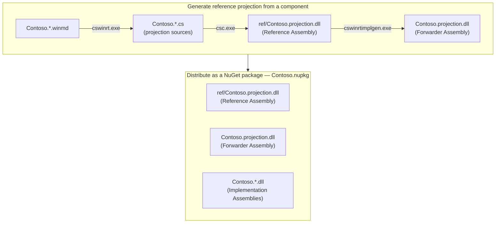
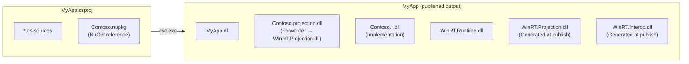

# Usage Guide

The [C#/WinRT NuGet package](https://www.nuget.org/packages/Microsoft.Windows.CsWinRT/) provides tooling for the following scenarios:

- [Generate and distribute an interop assembly](#generate-and-distribute-an-interop-assembly)
- [Author and consume a C#/WinRT component](#author-and-consume-a-cwinrt-component) (coming soon for 3.0)

For more information on using the NuGet package, refer to the [NuGet documentation](../nuget/readme.md). Command line options can be displayed by running `cswinrt -?`.

## Generate and distribute an interop assembly

Component authors need to build a C#/WinRT interop assembly for .NET Core consumers. The C#/WinRT NuGet package (Microsoft.Windows.CsWinRT) includes the tooling which processes the .winmd files and generates a reference projection assembly under the `ref` subfolder to represent the API surface along with a fowarder assembly. These can then be distributed for .NET Core applications (.NET 10+) to reference.

For an example of generating and distributing a projection interop assembly as a NuGet package, see the [projection sample](https://github.com/microsoft/CsWinRT/tree/master/src/Samples/NetProjectionSample).  Note that this sample hasn't been updated yet and will be updated once the package is released on NuGet.

### Generating an interop assembly

Component authors create a projection project, which is a C# library project that references the C#/WinRT NuGet package and the project-specific `.winmd` files you want to project, whether through a NuGet package reference, project reference, or direct file reference.

The following project fragment demonstrates a simple invocation of C#/WinRT to generate projection sources for types in the "Contoso" namespace. These sources are then included in the project build. By default, the **Windows** and **Microsoft** namespaces are not projected.  The `CsWinRTGenerateReferenceProjection` property indicates this library is a projection project and configures it to generate a reference projection.

```xml  
<PropertyGroup>
  <CsWinRTGenerateReferenceProjection>true</CsWinRTGenerateReferenceProjection>
  <CsWinRTIncludes>Contoso</CsWinRTIncludes>
</PropertyGroup>
```

For a full list of C#/WinRT NuGet project properties, refer to the [NuGet documentation](../nuget/readme.md).

In the example diagram below, the projection project invokes **cswinrt.exe** at build time, which processes `.winmd` files in the "Contoso" namespace to generate projection source files and compiles these into an reference projection assembly named `Contoso.projection.dll` under the `ref` subfolder along with a forwarder assembly with the same name. The reference and forwarder assembly is typically distributed along with the implementation assemblies (`Contoso.*.dll`) as a NuGet package. 


```mermaid
flowchart TD
    subgraph build ["Generate reference projection from a component"]
        direction LR
        WINMD["Contoso.*.winmd"] -->|cswinrt.exe| CS["Contoso.*.cs\n(projection sources)"]
        CS -->|csc.exe| REF["ref/Contoso.projection.dll\n(Reference Assembly)"]
        REF -->|cswinrtimplgen.exe| FWD["Contoso.projection.dll\n(Forwarder Assembly)"]
    end

    subgraph nupkg ["Distribute as a NuGet package — Contoso.nupkg"]
        R["ref/Contoso.projection.dll\n(Reference Assembly)"]
        F["Contoso.projection.dll\n(Forwarder Assembly)"]
        I["Contoso.*.dll\n(Implementation Assemblies)"]
    end

    build --> nupkg
```

### Distributing the interop assembly

The reference and forwarder assembly is typically distributed along with the implementation assemblies as a NuGet package for applications to reference. If the interop assembly is not distributed as a NuGet package, an application adds references to both the component interop assembly produced above and to C#/WinRT. If a third party WinRT component is distributed without an official interop assembly, an application may add a reference to C#/WinRT to generate its own private component interop assembly assuming that is the only projection for it.  There are versioning concerns related to this scenario, so the preferred solution is for the third party to publish an interop assembly directly.

See the [projection sample](https://github.com/microsoft/CsWinRT/tree/master/src/Samples/NetProjectionSample) for an example of how to create and reference the interop NuGet package.

### Applications

Application developers on .NET 10+ can reference C#/WinRT interop assemblies by adding a reference to the interop NuGet package, as shown in the diagram below. This replaces any `*.winmd` references.


```mermaid
flowchart LR
    subgraph proj ["MyApp.csproj"]
        SRC["*.cs sources"]
        NuGet["Contoso.nupkg\n(NuGet reference)"]
    end

    proj -->|csc.exe| exe

    subgraph exe ["MyApp (published output)"]
        A["MyApp.dll"]
        B["Contoso.projection.dll\n(Forwarder → WinRT.Projection.dll)"]
        C["Contoso.*.dll\n(Implementation)"]
        D["WinRT.Runtime.dll"]
        E["WinRT.Projection.dll\n(Generated at publish)"]
        F["WinRT.Interop.dll\n(Generated at publish)"]
    end
```

## Author and consume a C#/WinRT component

This is coming soon for CsWinRT 3.0.

C#/WinRT provides authoring and hosting support for C# component authors. For more details, refer to this [walkthrough](https://docs.microsoft.com/en-us/windows/uwp/csharp-winrt/create-windows-runtime-component-cswinrt) and these [authoring docs](https://github.com/microsoft/CsWinRT/blob/master/docs/authoring.md).