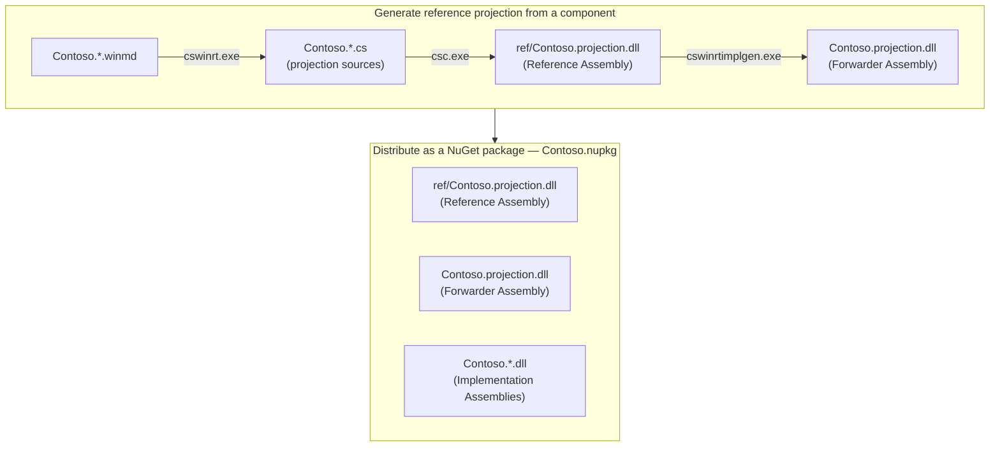
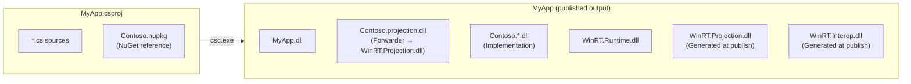

# Usage Guide

The [C#/WinRT NuGet package](https://www.nuget.org/packages/Microsoft.Windows.CsWinRT/) provides tooling for the following scenarios:

- [Generate and distribute a projection](#generate-and-distribute-a-projection)
- [Author and consume a C#/WinRT component](#author-and-consume-a-cwinrt-component) (coming soon for 3.0)

For more information on using the NuGet package, refer to the [NuGet documentation](../nuget/readme.md). Command line options can be displayed by running `cswinrt -?`.

## Getting started with CsWinRT 3.0

CsWinRT 3.0 requires **.NET 10** or later and is supported with the new `.1` **Target framework revision number**.  To opt-in to using the CsWinRT 3.0, you would need to update your target framework as below.  You may choose to multi-target to support both CsWinRT 3.0 and CsWinRT 2.x.

```xml
<!-- CsWinRT 3.0 -->
<TargetFramework>net10.0-windows10.0.22621.1</TargetFramework>

<!-- CsWinRT 2.x -->
<TargetFramework>net10.0-windows10.0.22621.0</TargetFramework>
```

## Generate and distribute a projection

Component authors need to build a C#/WinRT projection for .NET Core consumers. The C#/WinRT NuGet package (Microsoft.Windows.CsWinRT) includes the tooling which processes the .winmd files and generates a reference projection assembly under the `ref` subfolder to represent the API surface along with a forwarder assembly. These can then be distributed for .NET Core applications (.NET 10+) to reference.

For an example of generating and distributing a projection as a NuGet package, see the [projection sample](https://github.com/microsoft/CsWinRT/tree/master/src/Samples/NetProjectionSample). Note that this sample hasn't been updated yet and will be updated once the package is released on NuGet.

### Generating a reference projection

Component authors create a projection project, which is a C# library project that references the C#/WinRT NuGet package and the project-specific `.winmd` files you want to project, whether through a NuGet package reference, project reference, or direct file reference.

Here is an example project file for a projection project that generates a reference projection for types in the "Contoso" namespace:

```xml
<Project Sdk="Microsoft.NET.Sdk">

  <PropertyGroup>
    <TargetFramework>net10.0-windows10.0.22621.1</TargetFramework>
    <CsWinRTGenerateReferenceProjection>true</CsWinRTGenerateReferenceProjection>
    <CsWinRTIncludes>Contoso</CsWinRTIncludes>

    <!-- Needed until the Windows SDK projection package with CsWinRT 3.0 support is available in the .NET SDK. -->
    <WindowsSdkPackageVersion>10.0.22621.85-preview</WindowsSdkPackageVersion>
  </PropertyGroup>

  <ItemGroup>
    <PackageReference Include="Microsoft.Windows.CsWinRT" Version="3.0.0-preview.260319.2" />
  </ItemGroup>

  <ItemGroup>
    <ProjectReference Include="..\Contoso\Contoso.vcxproj" />
  </ItemGroup>

</Project>
```

By default, the **Windows** and **Microsoft** namespaces are not projected. The `CsWinRTGenerateReferenceProjection` property indicates this library is a projection project and configures it to generate a reference projection. For a full list of C#/WinRT NuGet project properties, refer to the [NuGet documentation](../nuget/readme.md).

In the example diagram below, the projection project invokes **cswinrt.exe** at build time, which processes `.winmd` files in the "Contoso" namespace to generate projection source files and compiles these into a reference projection assembly named `Contoso.projection.dll` under the `ref` subfolder along with a forwarder assembly with the same name. The reference and forwarder assembly is typically distributed along with the implementation assemblies (`Contoso.*.dll`) as a NuGet package.


```mermaid
flowchart TD
    subgraph build ["Generate reference projection from a component"]
        direction LR
        WINMD["Contoso.*.winmd"] -->|cswinrt.exe| CS["Contoso.*.cs\n(projection sources)"]
        CS -->|csc.exe| REF["ref/Contoso.projection.dll\n(Reference Assembly)"]
        REF -->|cswinrtimplgen.exe| FWD["Contoso.projection.dll\n(Forwarder Assembly)"]
    end

    subgraph nupkg ["Distribute as a NuGet package — Contoso.nupkg"]
        R["ref/Contoso.projection.dll\n(Reference Assembly)"]
        F["Contoso.projection.dll\n(Forwarder Assembly)"]
        I["Contoso.*.dll\n(Implementation Assemblies)"]
    end

    build --> nupkg
```

### Distributing the projection

The reference and forwarder assembly is typically distributed along with the implementation assemblies as a NuGet package for applications to reference.

- If the projection is **not** distributed as a NuGet package, an application adds references to both the component projection assembly produced above and to C#/WinRT.
- If a third party WinRT component is distributed **without** an official projection, an application may add a reference to C#/WinRT to generate its own private component projection, assuming that is the only projection for it.
- There are versioning concerns related to the above scenario, so the **preferred solution** is for the third party to publish a projection directly.

See the [projection sample](https://github.com/microsoft/CsWinRT/tree/master/src/Samples/NetProjectionSample) for an example of how to create and reference a projection NuGet package.

### Applications

Application developers on .NET 10+ can reference C#/WinRT projection assemblies by adding a reference to the projection NuGet package. This replaces any `*.winmd` references.

At **build time**, CsWinRT automatically generates additional assemblies for the application:

- **`WinRT.Projection.dll`** — contains the actual projection implementations for all WinRT types of reference projections referenced by the application.
- **`WinRT.Interop.dll`** — contains deduplicated marshalling code, native COM interface entries, and vtable implementations for the entire application. Because this is generated after all assemblies are compiled, it can analyze the full application and avoid duplicate marshalling stubs.

This means component authors don't need to update their packages when a new CsWinRT version ships — the application generates the latest optimized implementations at application build time.


```mermaid
flowchart LR
    subgraph proj ["MyApp.csproj"]
        SRC["*.cs sources"]
        NuGet["Contoso.nupkg\n(NuGet reference)"]
    end

    proj -->|csc.exe| exe

    subgraph exe ["MyApp (published output)"]
        A["MyApp.dll"]
        B["Contoso.projection.dll\n(Forwarder → WinRT.Projection.dll)"]
        C["Contoso.*.dll\n(Implementation)"]
        D["WinRT.Runtime.dll"]
        E["WinRT.Projection.dll\n(Generated at publish)"]
        F["WinRT.Interop.dll\n(Generated at publish)"]
    end
```

## Native AOT and trimming

CsWinRT 3.0 is designed with **AOT** in mind from the start. All generated projections are fully compatible with Native AOT and IL trimming without requiring any additional configuration from the developer.

- **Trimming** is safe by default — all generated code is fully trimmable.
- **Native AOT** works out of the box — vtables, COM interface entries, and CCW (COM Callable Wrapper) data are pre-initialized at publish time and foldable into readonly data sections by the Native AOT compiler.
- **Runtime feature switches** allow opt-in/opt-out of specific features (e.g., manifest-free activation, XAML type marshalling). Disabled features are dead-code-eliminated by the trimmer, making them fully pay-for-play.

For more details, see the [AOT and trimming documentation](aot-trimming.md).

## Key MSBuild properties

Below are the most commonly used MSBuild properties. For a full list, refer to the [NuGet documentation](../nuget/readme.md).

| Property | Default | Description |
|----------|---------|-------------|
| `CsWinRTEnabled` | `true` | Master switch — enables/disables all CsWinRT processing. |
| `CsWinRTGenerateProjection` | `true` | Generate C# projection sources from `.winmd` metadata. |
| `CsWinRTGenerateReferenceProjection` | `false` | Generate reference-only projections (for NuGet distribution). |
| `CsWinRTComponent` | `false` | Enable Windows Runtime component authoring mode. |
| `CsWinRTIncludes` | *(empty)* | Semicolon-separated namespaces to include in the projection. |
| `CsWinRTExcludes` | `Windows;Microsoft` | Semicolon-separated namespaces to exclude from the projection. |
| `CsWinRTMessageImportance` | `normal` | Build message verbosity (`normal` or `high`). |

## Author and consume a C#/WinRT component

This is coming soon for CsWinRT 3.0.

C#/WinRT provides authoring and hosting support for C# component authors. For more details, refer to this [walkthrough](https://docs.microsoft.com/en-us/windows/uwp/csharp-winrt/create-windows-runtime-component-cswinrt) and these [authoring docs](https://github.com/microsoft/CsWinRT/blob/master/docs/authoring.md).