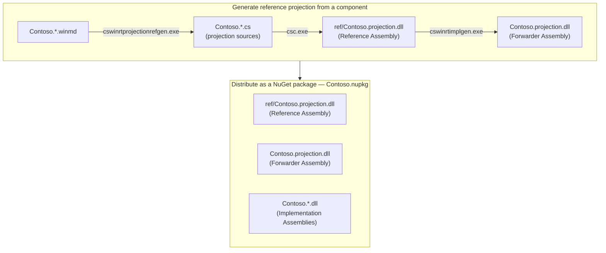
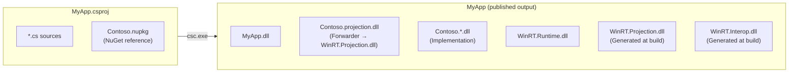

# Usage Guide

The [C#/WinRT NuGet package](https://www.nuget.org/packages/Microsoft.Windows.CsWinRT/) provides tooling for the following scenarios:

- [Generate and distribute a projection](#generate-and-distribute-a-projection)
- [Author and consume a C#/WinRT component](#author-and-consume-a-cwinrt-component) (coming soon for 3.0)

For more information on using the NuGet package, refer to the [NuGet documentation](../nuget/readme.md). Command line options can be displayed by running `cswinrtprojectionrefgen -h`.

## Getting started with CsWinRT 3.0

CsWinRT 3.0 requires **.NET 10** or later and is supported with the new `.1` **Target framework revision number**.  To opt-in to using the CsWinRT 3.0, you would need to update your target framework as below.  You may choose to multi-target to support both CsWinRT 3.0 and CsWinRT 2.x.

```xml
<!-- CsWinRT 3.0 -->
<TargetFramework>net10.0-windows10.0.22621.1</TargetFramework>

<!-- CsWinRT 2.x -->
<TargetFramework>net10.0-windows10.0.22621.0</TargetFramework>
```

## Generate and distribute a projection

Component authors need to build a C#/WinRT projection for .NET Core consumers. The C#/WinRT NuGet package (Microsoft.Windows.CsWinRT) includes the tooling which processes the .winmd files and generates a reference projection assembly under the `ref` subfolder to represent the API surface along with a forwarder assembly. These can then be distributed for .NET Core applications (.NET 10+) to reference.

For an example of generating and distributing a projection as a NuGet package, see the [projection sample](https://github.com/microsoft/CsWinRT/tree/master/src/Samples/NetProjectionSample). Note that this sample hasn't been updated yet and will be updated once the package is released on NuGet.

### Generating a reference projection

Component authors create a projection project, which is a C# library project that references the C#/WinRT NuGet package and the project-specific `.winmd` files you want to project, whether through a NuGet package reference, project reference, or direct file reference.

Here is an example project file for a projection project that generates a reference projection for types in the "Contoso" namespace:

```xml
<Project Sdk="Microsoft.NET.Sdk">

  <PropertyGroup>
    <TargetFramework>net10.0-windows10.0.22621.1</TargetFramework>
    <CsWinRTGenerateReferenceProjection>true</CsWinRTGenerateReferenceProjection>
    <CsWinRTIncludes>Contoso</CsWinRTIncludes>

    <!-- Needed until the Windows SDK projection package with CsWinRT 3.0 support is available in the .NET SDK. -->
    <WindowsSdkPackageVersion>10.0.22621.85-preview</WindowsSdkPackageVersion>
  </PropertyGroup>

  <ItemGroup>
    <PackageReference Include="Microsoft.Windows.CsWinRT" Version="3.0.0-preview.260319.2" />
  </ItemGroup>

  <ItemGroup>
    <ProjectReference Include="..\Contoso\Contoso.vcxproj" />
  </ItemGroup>

</Project>
```

By default, the **Windows** and **Microsoft** namespaces are not projected. The `CsWinRTGenerateReferenceProjection` property indicates this library is a projection project and configures it to generate a reference projection. For a full list of C#/WinRT NuGet project properties, refer to the [NuGet documentation](../nuget/readme.md).

In the example diagram below, the projection project invokes **cswinrtprojectionrefgen.exe** at build time, which processes `.winmd` files in the "Contoso" namespace to generate projection source files and compiles these into a reference projection assembly named `Contoso.projection.dll` under the `ref` subfolder along with a forwarder assembly with the same name. The reference and forwarder assembly is typically distributed along with the implementation assemblies (`Contoso.*.dll`) as a NuGet package.


```mermaid
flowchart TD
    subgraph build ["Generate reference projection from a component"]
        direction LR
        WINMD["Contoso.*.winmd"] -->|cswinrtprojectionrefgen.exe| CS["Contoso.*.cs\n(projection sources)"]
        CS -->|csc.exe| REF["ref/Contoso.projection.dll\n(Reference Assembly)"]
        REF -->|cswinrtimplgen.exe| FWD["Contoso.projection.dll\n(Forwarder Assembly)"]
    end

    subgraph nupkg ["Distribute as a NuGet package — Contoso.nupkg"]
        R["ref/Contoso.projection.dll\n(Reference Assembly)"]
        F["Contoso.projection.dll\n(Forwarder Assembly)"]
        I["Contoso.*.dll\n(Implementation Assemblies)"]
    end

    build --> nupkg
```

### Projecting standalone exclusive interfaces

A reference projection can expose selected `[ExclusiveTo]` interfaces without also projecting their owning runtime classes. For example, a supplemental UWP XAML projection can expose an interface from the Windows SDK while its owner remains in `WinRT.Sdk.Xaml.Projection.dll`:

```xml
<PropertyGroup>
  <UseUwp>true</UseUwp>
  <UseUwpTools>false</UseUwpTools>
  <CsWinRTGenerateReferenceProjection>true</CsWinRTGenerateReferenceProjection>
  <CsWinRTIncludes>Windows.UI.Xaml.IFrameworkElementProtected7</CsWinRTIncludes>
  <CsWinRTPublicExclusiveToInterfaces>true</CsWinRTPublicExclusiveToInterfaces>
  <CsWinRTDynamicallyInterfaceCastableExclusiveTo>true</CsWinRTDynamicallyInterfaceCastableExclusiveTo>
</PropertyGroup>
```

The two switches are independent. `CsWinRTPublicExclusiveToInterfaces` controls public visibility; it does **not** enable dynamic interface casting. `CsWinRTDynamicallyInterfaceCastableExclusiveTo` enables IDIC support without making an internal interface public. Both default to `false`. Public-only interfaces still have the ABI helpers and CCW implementations needed for managed implementations; disabling IDIC does not remove this infrastructure, default interfaces, or overridable interfaces.

To narrow the IDIC opt-in while keeping all projected exclusive interfaces public, set dedicated filters on the projection project:

```xml
<PropertyGroup>
  <CsWinRTPublicExclusiveToInterfaces>true</CsWinRTPublicExclusiveToInterfaces>
  <CsWinRTDynamicallyInterfaceCastableExclusiveTo>true</CsWinRTDynamicallyInterfaceCastableExclusiveTo>
  <CsWinRTDynamicallyInterfaceCastableExclusiveToIncludes>Contoso.IWidget;Contoso.Controls</CsWinRTDynamicallyInterfaceCastableExclusiveToIncludes>
  <CsWinRTDynamicallyInterfaceCastableExclusiveToExcludes>Contoso.IWidget3</CsWinRTDynamicallyInterfaceCastableExclusiveToExcludes>
</PropertyGroup>
```

**Filter rules:**

| IDIC switch | Includes | Excludes | IDIC selection |
|-------------|----------|----------|----------------|
| `false` or unset | Any | Any | None |
| `true` | Empty | Empty | All otherwise eligible exclusive interfaces |
| `true` | Empty | B | All eligible exclusives except B |
| `true` | A | Empty | Only eligible matches of A |
| `true` | A;B | B | Only eligible matches of A that do not match B |
| `true` | A specific type | Its namespace | None; exclusions always win |

Lists are semicolon-separated and use the same **case-sensitive namespace/type-name prefix matching** as projection filters, not wildcard or regular-expression syntax. For example, `Contoso.IWidget` also matches `Contoso.IWidget2`; use narrower prefixes and exclusions where necessary. Outer whitespace is trimmed, empty entries are ignored, and duplicates are removed. Invalid prefixes (such as `Contoso.*`, `Contoso..IWidget`, or embedded whitespace) produce `CSWINRTPROJECTIONGEN5022`; valid unmatched prefixes are harmless. The CLI equivalents are `--idic-exclusive-to-includes` and `--idic-exclusive-to-excludes`, with comma-separated lists in the response file.

These filters affect casting support only, not public visibility or which APIs are selected by `CsWinRTIncludes` / `CsWinRTExcludes`. Ordinary, non-exclusive interfaces are unaffected. For a native wrapper that does not statically implement an excluded interface, `is` returns `false`, `as` returns `null`, and an explicit cast throws `InvalidCastException`. Ordinary casts to interfaces already implemented by an object are unaffected. Enabled dynamic casts still require the native object to support the interface IID and the runtime's `CsWinRTEnableIDynamicInterfaceCastableSupport` switch to remain enabled.

**Reference packages and consumers:** the producer records the sorted, exact effective IDIC type names as `WindowsRuntimeReferenceAssemblyMetadataAttribute` key/value pairs, one per selected interface. This WinRT-specific attribute has the same shape as `AssemblyMetadataAttribute`: a `(string key, string? value)` constructor and read-only `Key` / `Value` properties, with repeated keys supported. The reference assembly marker `WindowsRuntimeReferenceAssemblyAttribute` is unchanged. For example, generated reference metadata can contain:

```csharp
[assembly: WindowsRuntimeReferenceAssembly]
[assembly: WindowsRuntimeReferenceAssemblyMetadata("CsWinRT.IdicExclusiveTo.v1", "Contoso.IWidget2")]
[assembly: WindowsRuntimeReferenceAssemblyMetadata("CsWinRT.IdicExclusiveTo.v1", "Contoso.IWidget3")]
```

These are generator-owned attributes, not annotations to write manually. String names preserve intent even for internal interfaces omitted by reference-assembly compilation. The metadata remains in the packed `ref/<tfm>` assembly, not the forwarder; the consumer restores exactly that selection independently of the actual public reference surface. Unknown keys are ignored, and ordinary `AssemblyMetadataAttribute` entries do not opt interfaces into IDIC. Prefixes are not reapplied to other packages. No selection entries means no exclusive-interface IDIC; **regenerate older preview projection packages that need IDIC support**. There is no public-visibility inference or consumer-side policy override.

Consumers do not need to repeat the producer's exclusive-interface options. Projected runtime type identities must be globally unique: duplicate definitions across reference projections fail with `CSWINRTPROJECTIONGEN0015`, regardless of whether their policies agree. Metadata-only attribute projections do not contribute interop type-map keys and are exempt from this check. Malformed IDIC metadata fails with `CSWINRTPROJECTIONGEN0014`.

A projection over Windows SDK metadata alone does not need to redistribute that metadata or add it to `CsWinRTInputs`: the app-time generator uses the configured Windows SDK metadata. The standalone `IFrameworkElementProtected7` example above therefore keeps its owner in `WinRT.Sdk.Xaml.Projection.dll` while preserving both public visibility and IDIC for the selected interface.

### Distributing the projection

The reference and forwarder assembly is typically distributed along with the implementation assemblies as a NuGet package for applications to reference.

- If the projection is **not** distributed as a NuGet package, an application adds references to both the component projection assembly produced above and to C#/WinRT.
- If a third party WinRT component is distributed **without** an official projection, an application may add a reference to C#/WinRT to generate its own private component projection, assuming that is the only projection for it.
- There are versioning concerns related to the above scenario, so the **preferred solution** is for the third party to publish a projection directly.

See the [projection sample](https://github.com/microsoft/CsWinRT/tree/master/src/Samples/NetProjectionSample) for an example of how to create and reference a projection NuGet package.

### Applications

Application developers on .NET 10+ can reference C#/WinRT projection assemblies by adding a reference to the projection NuGet package. This replaces any `*.winmd` references.

At **build time**, CsWinRT automatically generates additional assemblies for the application:

- **`WinRT.Projection.dll`** — contains the actual projection implementations for all WinRT types of reference projections referenced by the application.
- **`WinRT.Interop.dll`** — contains deduplicated marshalling code, native COM interface entries, and vtable implementations for the entire application. Because this is generated after all assemblies are compiled, it can analyze the full application and avoid duplicate marshalling stubs.

This means component authors don't need to update their packages when a new CsWinRT version ships — the application generates the latest optimized implementations at application build time.


```mermaid
flowchart LR
    subgraph proj ["MyApp.csproj"]
        SRC["*.cs sources"]
        NuGet["Contoso.nupkg\n(NuGet reference)"]
    end

    proj -->|csc.exe| exe

    subgraph exe ["MyApp (published output)"]
        A["MyApp.dll"]
        B["Contoso.projection.dll\n(Forwarder → WinRT.Projection.dll)"]
        C["Contoso.*.dll\n(Implementation)"]
        D["WinRT.Runtime.dll"]
        E["WinRT.Projection.dll\n(Generated at build)"]
        F["WinRT.Interop.dll\n(Generated at build)"]
    end
```

## Native AOT and trimming

CsWinRT 3.0 is designed with **AOT** in mind from the start. All generated projections are fully compatible with Native AOT and IL trimming without requiring any additional configuration from the developer.

- **Trimming** is safe by default — all generated code is fully trimmable.
- **Native AOT** works out of the box — vtables, COM interface entries, and CCW (COM Callable Wrapper) data are pre-initialized at publish time and foldable into readonly data sections by the Native AOT compiler.
- **Runtime feature switches** allow opt-in/opt-out of specific features (e.g., manifest-free activation, XAML type marshalling). Disabled features are dead-code-eliminated by the trimmer, making them fully pay-for-play.

For more details, see the [AOT and trimming documentation](aot-trimming.md).

## Key MSBuild properties

Below are the most commonly used MSBuild properties. For a full list, refer to the [NuGet documentation](../nuget/readme.md).

| Property | Default | Description |
|----------|---------|-------------|
| `CsWinRTEnabled` | `true` | Master switch — enables/disables all CsWinRT processing. |
| `CsWinRTGenerateProjection` | `true` | Generate C# projection sources from `.winmd` metadata. |
| `CsWinRTGenerateReferenceProjection` | `false` | Generate reference-only projections (for NuGet distribution). |
| `CsWinRTComponent` | `false` | Enable Windows Runtime component authoring mode. |
| `CsWinRTMarshallingMode` | `minimal` | Controls which assemblies the interop generator analyzes for marshalling code (`all`, `minimal`, or `strict`). See below. |
| `CsWinRTIncludes` | *(empty)* | Semicolon-separated namespaces to include in the projection. |
| `CsWinRTExcludes` | `Windows;Microsoft` | Semicolon-separated namespaces to exclude from the projection. |
| `CsWinRTMessageImportance` | `normal` | Build message verbosity (`normal` or `high`). |

### Marshalling mode

By default (`minimal`), the interop generator analyzes **every** assembly in the app to discover user-defined
(CCW) types and generic instantiations that need marshalling code — even assemblies that don't target a
Windows TFM and don't reference any CsWinRT assembly — with the exception of the .NET base class library
(BCL). This means a plain `.NET` class library (e.g. one holding MVVM viewmodels) no longer needs to target
a `-windows` TFM just so its types can be marshalled to native code, while the BCL is skipped to keep the
generated interop assembly small.

`CsWinRTMarshallingMode` controls this behavior:

| Value | Behavior |
|-------|----------|
| `all` | Analyze all assemblies, including those from the .NET base class library (BCL). |
| `minimal` (default) | Same as `all`, but skip assemblies from the .NET base class library (BCL) to reduce binary size. |
| `strict` | Only analyze assemblies referencing the Windows Runtime assembly (i.e. those targeting a Windows TFM). |

Assemblies that reference the Windows Runtime assembly are always analyzed, regardless of the mode. Assemblies targeting a legacy or portable runtime (i.e. .NET Standard or .NET Framework) are never analyzed, since the interop generator can only marshal types declared against a modern .NET runtime.

### Opting in specific assemblies

The `CsWinRTMarshallingEnabledAssembly` item lets you force the interop generator to analyze specific assemblies, regardless of the marshalling mode. This is useful for fine-tuning binary size: for example, you can keep the `strict` mode (the smallest option) while opting in just the few assemblies you know need marshalling support:

```xml
<PropertyGroup>
  <CsWinRTMarshallingMode>strict</CsWinRTMarshallingMode>
</PropertyGroup>

<ItemGroup>
  <CsWinRTMarshallingEnabledAssembly Include="MyApp.ViewModels" />
  <CsWinRTMarshallingEnabledAssembly Include="MyApp.Models" />
</ItemGroup>
```

Each item is an assembly name (the `.dll` extension is optional). The interop generator reports a warning if an entry doesn't match any referenced assembly, and an informational message if an entry is redundant (e.g. it already targets Windows, or the mode is `all` and thus already analyzes everything).

## Author and consume a C#/WinRT component

This is coming soon for CsWinRT 3.0.

C#/WinRT provides authoring and hosting support for C# component authors. For more details, refer to this [walkthrough](https://docs.microsoft.com/en-us/windows/uwp/csharp-winrt/create-windows-runtime-component-cswinrt) and these [authoring docs](https://github.com/microsoft/CsWinRT/blob/master/docs/authoring.md).