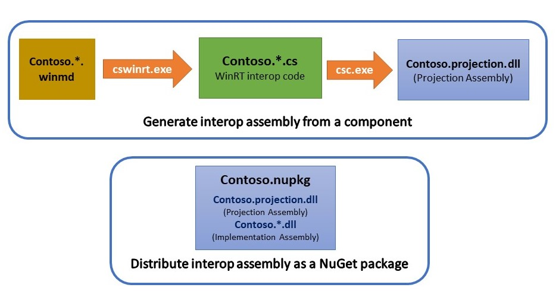
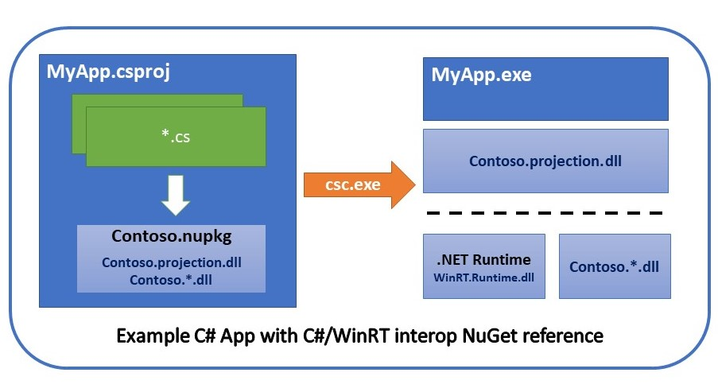

# Usage Guide

The [C#/WinRT NuGet package](https://www.nuget.org/packages/Microsoft.Windows.CsWinRT/) provides tooling for the following scenarios:

- [Generate and distribute an interop assembly](#generate-and-distribute-an-interop-assembly)
- [Author and consume a C#/WinRT component](#author-and-consume-a-cwinrt-component) (in preview)

For more information on using the NuGet package, refer to the [NuGet documentation](../nuget/readme.md). Command line options can be displayed by running `cswinrt -?`.

## Generate and distribute an interop assembly

Component authors need to build a C#/WinRT interop assembly for .NET 5+ consumers. The C#/WinRT NuGet package (Microsoft.Windows.CsWinRT) includes the C#/WinRT compiler, **cswinrt.exe**, which you can use to process .winmd files and generate projection source files. These source files are compiled into an interop projection assembly, and then distributed along with the C#/WinRT runtime assembly for .NET 5+ applications to reference.

For an example of generating and distributing a projection interop assembly as a NuGet package, see the [projection sample](https://github.com/microsoft/CsWinRT/tree/master/src/Samples/Net5ProjectionSample) and [associated walkthrough](https://docs.microsoft.com/windows/uwp/csharp-winrt/net-projection-from-cppwinrt-component).

### Generating an interop assembly

Component authors create a projection project, which is a C# library project that references the C#/WinRT NuGet package and the project-specific `.winmd` files you want to project, whether through a NuGet package reference, project reference, or direct file reference.

The following project fragment demonstrates a simple invocation of C#/WinRT to generate projection sources for types in the "Contoso" namespace. These sources are then included in the project build. By default, the **Windows** and **Microsoft** namespaces are not projected.

```xml  
<PropertyGroup>
  <CsWinRTIncludes>Contoso</CsWinRTIncludes>
</PropertyGroup>
```

For a full list of C#/WinRT NuGet project properties, refer to the [NuGet documentation](../nuget/readme.md).

In the example diagram below, the projection project invokes **cswinrt.exe** at build time, which processes `.winmd` files in the "Contoso" namespace to generate projection source files and compiles these into an interop projection assembly named `Contoso.projection.dll`. The interop assembly is typically distributed along with the implementation assemblies (`Contoso.*.dll`) as a NuGet package. 



### Distributing the interop assembly

An interop assembly is typically distributed along with the implementation assemblies as a NuGet package for application projects to reference. This package will require a dependency on C#/WinRT to include `WinRT.Runtime.dll` for .NET 5+ targets. If the interop assembly is not distributed as a NuGet package, an application project adds references to both the component interop assembly produced above and to C#/WinRT to include the `WinRT.Runtime.dll` assembly. If a third party WinRT component is distributed without an official interop assembly, an application project may add a reference to C#/WinRT to generate its own private component interop assembly.  There are versioning concerns related to this scenario, so the preferred solution is for the third party to publish an interop assembly directly.

See the [projection sample](https://github.com/microsoft/CsWinRT/tree/master/src/Samples/Net5ProjectionSample) for an example of how to create and reference the interop NuGet package.

### Application projects

Application developers on .NET 5+ can reference C#/WinRT interop assemblies by adding a reference to the interop NuGet package, as shown in the diagram below. This replaces any `*.winmd` references. The .NET 5+ application includes `WinRT.Runtime.dll` which handles WinRT type activation logic. 




## Author and consume a C#/WinRT component

C#/WinRT provides authoring and hosting support for .NET 5 component authors. For more details, refer to this [walkthrough](https://docs.microsoft.com/en-us/windows/uwp/csharp-winrt/create-windows-runtime-component-cswinrt) and these [authoring docs](https://github.com/microsoft/CsWinRT/blob/master/docs/authoring.md).