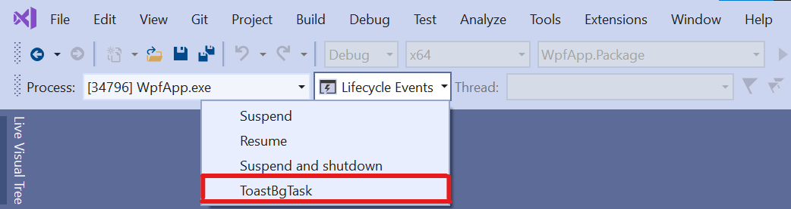
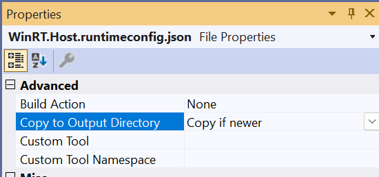

# Background Task C#/WinRT Authoring Sample

This sample demonstrates how to author an [out-of-process background task](https://docs.microsoft.com/windows/uwp/launch-resume/create-and-register-a-background-task) in a C#/WinRT component and how to consume the component from a packaged .NET 6 WPF app.

This sample includes the following projects:

- **BgTaskComponent**: This is a C#/WinRT component with an example background task that pops a toast notification.

- **WpfApp** and **WpfApp.Package**: These projects demonstrate hosting the background task component in a packaged .NET 6 desktop (WPF) application.

  - **WpfApp** has a project reference to **BgTaskComponent**.

  - **WpfApp.Package** is a packaging app with a reference to **WpfApp**. The packaging app is required for hosting out-of-process WinRT components.

## Prerequisites

* [.NET 8](https://dotnet.microsoft.com/download/dotnet/8.0)
* Visual Studio 2022

**Note**: This sample can be modified to target .NET 5 and Visual Studio 2019. This involves editing the `TargetFramework` properties to target `net5.0-windows10.0.19041.0`.

## Build and run the sample

1. Open **BgTaskComponent.sln** in Visual Studio 2022.

2. Ensure that the **WpfApp.Package** project is set as the startup project.

3. From Visual Studio, choose **Start Debugging** (F5).

### Triggering the background task

The **ToastBgTask** background task raises a toast notification and is triggered by a TimeZoneChange event. You can invoke the background task while debugging the sample by using the **Lifecycle Events** dropdown in Visual Studio as shown below:



You can also trigger the background task by changing your device's timezone in **Date & time settings**.

## C#/WinRT component hosting modifications

There are a few modifications to note that relate to those described in the [authoring docs](https://github.com/microsoft/CsWinRT/blob/master/docs/authoring.md). These modifications are required to successfully host the background task WinRT component in the WPF application.

- [**WinRT.Host.runtimeconfig.json**](BgTaskComponent/WinRT.Host.runtimeconfig.json) needs to be manually included in the C# component project, **BgTaskComponent**. This file also needs to be copied to the output directory by adding the following item group to **BgTaskComponent.csproj**:

  ```xml
    <ItemGroup>
      <None Update="WinRT.Host.runtimeconfig.json">
        <CopyToOutputDirectory>PreserveNewest</CopyToOutputDirectory>
      </None>
    </ItemGroup>
  ```

  Alternatively, you can set **Copy to Output Directory** to **Copy if newer** in the file's Properties in Visual Studio.

  

- In addition to registering the background task with the package manifest, the following extension group must be manually added to **Package.appxmanifest**. To do this, in Solution Explorer right click **Package.appxmanifest**, click **View Code**, and paste the code below.

  ```xml
  <!-- To host the BgTaskComponent, you must add this activatable class entry -->
  <Extensions>
      <Extension Category="windows.activatableClass.inProcessServer">
          <InProcessServer>
              <Path>WinRT.Host.dll</Path>
              <ActivatableClass ActivatableClassId="BgTaskComponent.ToastBgTask" ThreadingModel="both" />
          </InProcessServer>
      </Extension>
   </Extensions>
   ```