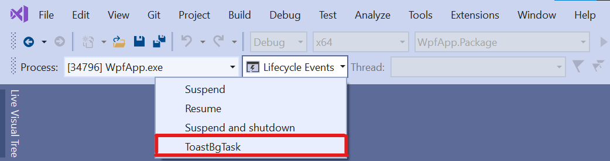

# Background Task C#/WinRT Authoring Sample

This sample demonstrates how to author an out-of-process C#/WinRT component using background tasks, and how to consume the component as a project reference from a packaged .NET 5 WPF app.

This sample includes the following projects:

- **BgTaskComponent**: This is a C#/WinRT component with an example background task that pops a toast notification.

- **WpfApp** and **WpfApp.Package**: These projects demonstrate hosting the background task component in a packaged .NET 5 desktop (WPF) application.

  - **WpfApp** has a project reference to **BgTaskComponent**.

  - **WpfApp.Package** is a packaging app with a reference to **WpfApp**. The packaging app is required for hosting out-of-process WinRT components.

## Build and run the sample

### Build the sample

1. Open the **BgTaskComponent.sln** in Visual Studio.

2. Right click on the **WpfApp.Package** project as select **Set as Startup Project**.

3. Press Ctrl+Shift+B, or select **Build** -> **Build Solution**.

### Deploy and run the  sample

1. Select **Build** -> **Deploy Solution** to deploy the sample.

2. To debug and run the sample, press F5 or select **Debug** -> **Start Debugging**.

### Triggering background tasks

The **ToastBgTask** background task raises a toast notification and is triggered by a TimeZoneChange event. You can invoke the background task while debugging the sample by using the **Lifecycle Events** dropdown in Visual Studio as shown below: 



You can also trigger the background task by changing your device's timezone in **Date & time settings**.

## C#/WinRT authoring modifications

There are a few modifications to note that relate to those described in the [authoring docs](https://github.com/microsoft/CsWinRT/blob/master/docs/authoring.md):

- Note that **WinRT.Host.runtimeconfig.json** is part of the authored component project, **BgTaskComponent**. The runtimeconfig file needs to be manually added to the project. This file is copied to the packaging project output by adding the following item group to **BgTaskComponent.csproj**:

  ```xml
    <ItemGroup>
      <None Update="WinRT.Host.runtimeconfig.json">
        <CopyToOutputDirectory>PreserveNewest</CopyToOutputDirectory>
      </None>
    </ItemGroup>
  ```

- In addition to registering the background task with the manifest designer, the following extension and class registration must be manually added to **Package.appxmanifest**. To do this, in Solution Explorer right click **Package.appxmanifest**, click **View Code**, and paste the code below. Note you do not need to create your own manifest file as this is a packaged app.

  ```xml
  <!-- To host the BgTaskComponent, you must add this activatable class entry -->
  <Extensions>
      <Extension Category="windows.activatableClass.inProcessServer">
          <InProcessServer>
              <Path>WinRT.Host.dll</Path>
              <ActivatableClass ActivatableClassId="BgTaskComponent.ToastBgTask" ThreadingModel="both" />
          </InProcessServer>
      </Extension>
   </Extensions>
   ```